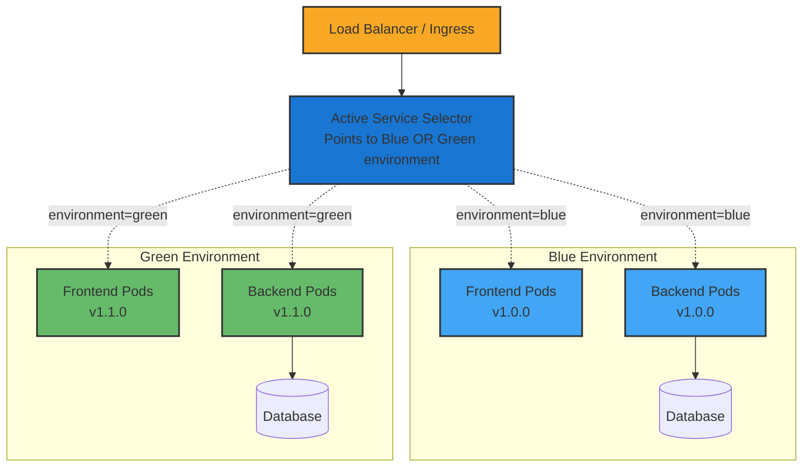
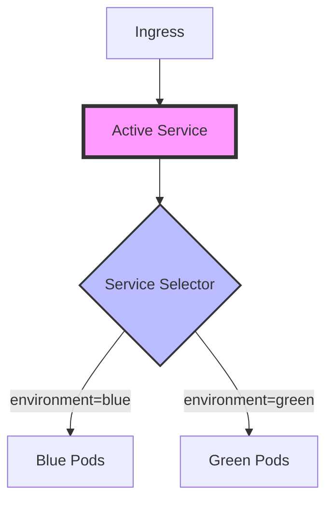
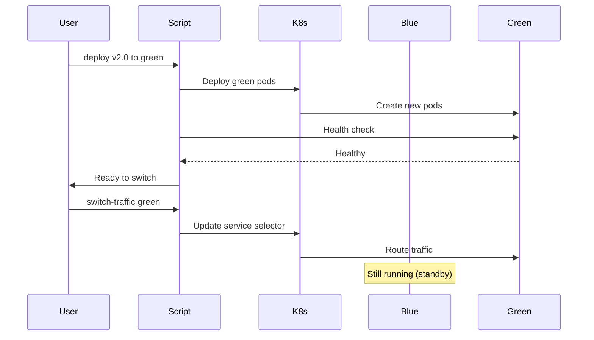
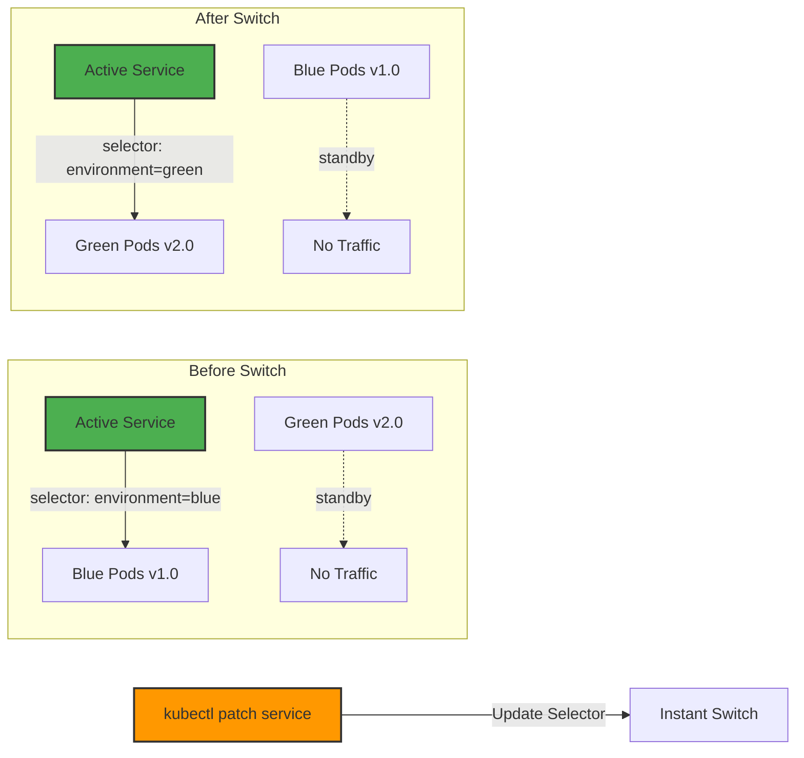
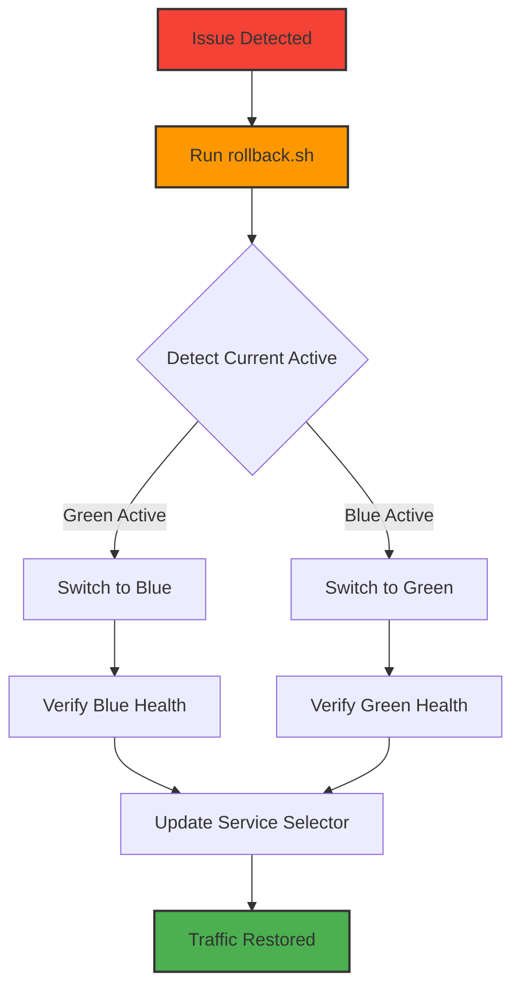

# Blue-Green Deployment with Kubernetes

A comprehensive implementation of blue-green deployment strategy using Kubernetes Services, Labels, Selectors, and automated traffic switching.

## What is Blue-Green Deployment?

Blue-green deployment is a technique that reduces downtime and risk by running two identical production environments called Blue and Green. At any time, only one of the environments is live, with the other serving as a staging environment.

### Key Characteristics

- **Two Identical Environments**: Maintain two complete, production-ready environments
- **Instant Switching**: Traffic routing changes happen at the load balancer level
- **Zero Downtime**: Users experience no interruption during deployments
- **Quick Rollback**: If issues arise, instantly switch back to the previous version

### Why Use Blue-Green Deployments?

#### Benefits

1. **Zero Downtime Deployments**
   - No service interruption during updates
   - Seamless user experience

2. **Instant Rollback Capability**
   - Previous version remains running and ready
   - Switch back in seconds if issues detected

3. **Production Testing**
   - Test new version with real production data
   - Validate performance before switching traffic

4. **Reduced Risk**
   - Full validation before traffic switch
   - No partial deployment states

5. **Simple Mental Model**
   - Clear separation between versions
   - Easy to understand and implement

#### Drawbacks

1. **Resource Requirements**
   - Doubles infrastructure costs during deployment
   - Requires capacity for two full environments

2. **Database Challenges**
   - Schema changes need careful planning
   - Backward compatibility required

3. **Stateful Applications**
   - Session management complexity
   - Cache synchronization issues

4. **Long-Running Transactions**
   - May be interrupted during switch
   - Requires graceful handling

### Comparison with Other Deployment Strategies

```mermaid
graph TD
    subgraph "Blue-Green"
        BG1[100% Blue] --> BG2[Deploy Green]
        BG2 --> BG3[Test Green]
        BG3 --> BG4[Switch to 100% Green]
    end
    
    subgraph "Rolling Update"
        RU1[100% v1] --> RU2[75% v1, 25% v2]
        RU2 --> RU3[50% v1, 50% v2]
        RU3 --> RU4[25% v1, 75% v2]
        RU4 --> RU5[100% v2]
    end
    
    subgraph "Canary"
        C1[100% v1] --> C2[95% v1, 5% v2]
        C2 --> C3[Monitor Metrics]
        C3 --> C4[90% v1, 10% v2]
        C4 --> C5[Gradual Increase]
    end
```



| Strategy | Rollback Speed | Resource Usage | Risk Level | Complexity |
|----------|---------------|----------------|------------|------------|
| **Blue-Green** | Instant | High (2x) | Low | Low |
| **Rolling Update** | Slow | Medium | Medium | Medium |
| **Canary** | Fast | Low-Medium | Very Low | High |
| **Recreate** | N/A | Low | High | Very Low |

### When to Use Blue-Green Deployments

**Ideal for:**
- Mission-critical applications requiring zero downtime
- Applications with simple deployment processes
- When instant rollback capability is essential
- Applications with stateless architectures

**Not Ideal for:**
- Applications with very large data stores
- When infrastructure costs are a primary concern
- Applications requiring gradual rollout to users
- Complex stateful applications

## Overview

This project demonstrates zero-downtime deployments using the blue-green deployment pattern. It includes:

- **Frontend**: React application with environment awareness
- **Backend**: Go API server with health checks and database integration
- **Database**: PostgreSQL with persistent storage
- **Automation**: Complete set of deployment and management scripts
- **Monitoring**: Health checks and traffic verification

## Architecture



## How Blue-Green Deployment Works Here

This implementation uses Kubernetes native features to achieve zero-downtime deployments:

### 1. Label-Based Traffic Routing



The core mechanism uses Kubernetes labels and selectors:
- Each pod is labeled with `environment: blue` or `environment: green`
- The active service selector determines which environment receives traffic
- Traffic switching is achieved by updating the service selector

### 2. Deployment Workflow



### 3. Zero-Downtime Benefits

- **No Connection Interruption**: Service selector update is atomic
- **Instant Rollback**: Previous environment remains running
- **Testing in Production**: Direct environment URLs for validation
- **Database Continuity**: Shared database with migration support

### 4. Traffic Switching Process



The traffic switch is performed by a single kubectl command:
```bash
kubectl patch service backend-service -n blue-green-webapp \
  -p '{"spec":{"selector":{"environment":"green"}}}'
```

### 5. Implementation Details

#### Service Configuration
```yaml
apiVersion: v1
kind: Service
metadata:
  name: backend-service
  namespace: blue-green-webapp
spec:
  selector:
    app: backend
    environment: blue  # This changes during traffic switch
  ports:
    - port: 8080
      targetPort: 8080
```

#### Pod Labels
```yaml
apiVersion: apps/v1
kind: Deployment
metadata:
  name: backend-blue
spec:
  template:
    metadata:
      labels:
        app: backend
        environment: blue  # Identifies blue environment
        version: v1.0.0
```

## Quick Start

### Prerequisites

1. **Kubernetes Cluster**: minikube, kind, or cloud provider
2. **kubectl**: Configured and authenticated
3. **Docker**: For building images
4. **Ingress Controller**: nginx-ingress for routing

### Setup Ingress Controller (if using minikube)

```bash
minikube addons enable ingress
```

### Add Local DNS Entries

Add these entries to your `/etc/hosts` file:

```bash
echo "$(minikube ip) blue-green-webapp.local" | sudo tee -a /etc/hosts
echo "$(minikube ip) blue.blue-green-webapp.local" | sudo tee -a /etc/hosts
echo "$(minikube ip) green.blue-green-webapp.local" | sudo tee -a /etc/hosts
```

### Initial Deployment

1. **Deploy to Blue Environment**:

   ```bash
   ./scripts/deploy-blue-green.sh v1.0.0 blue
   ```

2. **Access the Application**:

   - Main: http://blue-green-webapp.local
   - Blue: http://blue.blue-green-webapp.local

3. **Deploy New Version to Green**:

   ```bash
   ./scripts/deploy-blue-green.sh v1.1.0 green blue
   ```

4. **Switch Traffic**:
   ```bash
   ./scripts/switch-traffic.sh green blue
   ```

## Scripts Reference

### Deployment Script

```bash
./scripts/deploy-blue-green.sh [VERSION] [TARGET_ENV] [SOURCE_ENV]
```

**Example:**

```bash
./scripts/deploy-blue-green.sh v1.2.0 green blue
```

**Features:**

- Builds Docker images
- Deploys to target environment
- Runs health checks
- Optional traffic switching

### Traffic Switching Script

```bash
./scripts/switch-traffic.sh [TARGET_ENV] [SOURCE_ENV]
```

**Example:**

```bash
./scripts/switch-traffic.sh green blue
```

**Features:**

- Pre-switch validation
- Configuration backup
- Verification and monitoring
- Rollback guidance

### Rollback Script

```bash
./scripts/rollback.sh
```

**Features:**

- Automatic rollback target detection
- Emergency confirmation
- Immediate traffic switch
- Post-rollback verification

### Health Check Script

```bash
./scripts/health-check.sh [ENVIRONMENT]
```

**Examples:**

```bash
./scripts/health-check.sh          # Check all environments
./scripts/health-check.sh blue     # Check blue environment only
./scripts/health-check.sh green    # Check green environment only
```

**Features:**

- Pod health verification
- Service endpoint testing
- Resource usage monitoring
- Database connectivity checks

### Cleanup Script

```bash
./scripts/cleanup.sh [ENVIRONMENT] [force]
```

**Examples:**

```bash
./scripts/cleanup.sh blue          # Interactive cleanup
./scripts/cleanup.sh green force   # Force cleanup without confirmation
```

**Features:**

- Safety checks (prevents cleanup of active environment)
- Resource enumeration
- Confirmation prompts
- Verification of cleanup

## Deployment Workflow

### Standard Deployment Process

1. **Prepare**: Deploy new version to inactive environment

   ```bash
   ./scripts/deploy-blue-green.sh v1.1.0 green blue
   ```

2. **Test**: Validate new environment

   ```bash
   ./scripts/health-check.sh green
   curl http://green.blue-green-webapp.local/api/status
   ```

3. **Switch**: Move traffic to new environment

   ```bash
   ./scripts/switch-traffic.sh green blue
   ```

4. **Monitor**: Watch for issues

   ```bash
   kubectl logs -n blue-green-webapp -l environment=green -f
   ```

5. **Cleanup**: Remove old environment (optional)
   ```bash
   ./scripts/cleanup.sh blue
   ```

### Emergency Rollback



If issues are detected after traffic switch:

```bash
./scripts/rollback.sh
```

This will immediately switch traffic back to the previous environment.

## Monitoring and Troubleshooting

### Check Current Active Environment

```bash
kubectl get service backend-service -n blue-green-webapp -o jsonpath='{.spec.selector.environment}'
```

### View Deployment History

```bash
kubectl get service backend-service -n blue-green-webapp -o jsonpath='{.metadata.annotations}'
```

### Monitor Pods

```bash
# All pods
kubectl get pods -n blue-green-webapp

# Specific environment
kubectl get pods -n blue-green-webapp -l environment=blue

# Watch pods in real-time
kubectl get pods -n blue-green-webapp -l environment=green -w
```

### Check Logs

```bash
# Backend logs
kubectl logs -n blue-green-webapp -l app=backend,environment=green -f

# Frontend logs
kubectl logs -n blue-green-webapp -l app=frontend,environment=blue -f

# Database logs
kubectl logs -n blue-green-webapp -l app=postgres -f
```

### Service Endpoints

```bash
kubectl get endpoints -n blue-green-webapp
```

### Resource Usage

```bash
kubectl top pods -n blue-green-webapp
```

## Application Features

### Frontend (React)

- **Environment Awareness**: Displays current frontend and backend environments
- **Real-time Status**: Shows backend connectivity and version information
- **Visit Tracking**: Displays recent visits with environment/version details
- **Auto-refresh**: Updates data every 30 seconds
- **Responsive Design**: Works on desktop and mobile devices

### Backend (Go)

- **Health Endpoint**: `/health` - Kubernetes health checks
- **Status API**: `/api/status` - Environment and version information
- **Visit Tracking**: Records visits in PostgreSQL database
- **Database Integration**: Automatic connection retry and health monitoring
- **CORS Support**: Enables frontend communication

### Key Endpoints

- `GET /health` - Health check (used by Kubernetes probes)
- `GET /api/status` - Environment status and information
- `GET /api/version` - Version and uptime information
- `GET /api/visits` - Recent visit history

## Configuration

### Environment Variables

**Backend:**

- `ENVIRONMENT`: blue/green (set automatically by deployment)
- `VERSION`: Application version (set automatically)
- `DB_HOST`: Database hostname
- `DB_PORT`: Database port
- `DB_USER`: Database username
- `DB_PASSWORD`: Database password
- `DB_NAME`: Database name

**Frontend:**

- `REACT_APP_ENVIRONMENT`: blue/green (set automatically)
- `REACT_APP_VERSION`: Application version (set automatically)
- `REACT_APP_API_URL`: Backend API URL

### Kubernetes Resources

**Shared Resources:**

- Namespace: `blue-green-webapp`
- PostgreSQL StatefulSet with persistent storage
- ConfigMaps and Secrets
- Database service

**Environment-Specific Resources:**

- Backend Deployment (3 replicas)
- Frontend Deployment (2 replicas)
- Environment-specific services
- Resource limits and health checks

**Traffic Routing:**

- Active backend service (switches between environments)
- Active frontend service (switches between environments)
- Ingress with multiple hosts
- Direct environment access for testing

## Troubleshooting Guide

### Common Issues

1. **Pods not starting**:

   ```bash
   kubectl describe pod <pod-name> -n blue-green-webapp
   kubectl logs <pod-name> -n blue-green-webapp
   ```

2. **Database connection issues**:

   ```bash
   kubectl logs -n blue-green-webapp -l app=postgres
   ./scripts/health-check.sh
   ```

3. **Traffic not switching**:

   ```bash
   kubectl get service backend-service -n blue-green-webapp -o yaml
   kubectl get endpoints -n blue-green-webapp
   ```

4. **Build failures**:
   - Ensure Docker is running
   - Check image tags in deployment files
   - Verify go.mod and package.json are valid

### Reset Everything

To completely reset the deployment:

```bash
kubectl delete namespace blue-green-webapp
./scripts/deploy-blue-green.sh v1.0.0 blue
```
