# Blue-Green Deployment Interview Questions

## Question 1: Database Schema Evolution in Blue-Green Deployments

**Q:** How would you handle a breaking database schema change during a blue-green deployment where the new version requires a column that doesn't exist in the old schema, but you need to maintain zero-downtime rollback capability?

**A:** This is one of the most complex challenges in blue-green deployments. The solution requires a multi-phase approach:

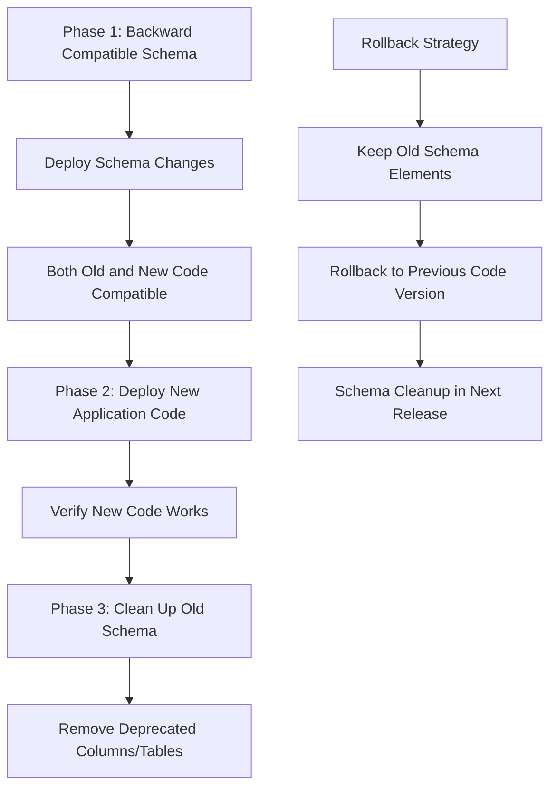

**Detailed Implementation Strategy:**

1. **Phase 1 - Backward Compatible Schema Changes:**

   ```sql
   -- Add new columns as nullable or with defaults
   ALTER TABLE users ADD COLUMN new_feature_flag BOOLEAN DEFAULT false;
   ALTER TABLE orders ADD COLUMN enhanced_metadata JSONB DEFAULT '{}';
   ```

2. **Phase 2 - Deploy Application Code:**

   - Old version ignores new columns
   - New version uses new columns but handles missing data gracefully
   - Both versions can coexist

3. **Phase 3 - Schema Cleanup:**
   - Only after confirming rollback is no longer needed
   - Remove old columns/tables in subsequent release

**Advanced Techniques:**

- **Feature Flags:** Use database-driven feature flags to control new functionality
- **Shadow Tables:** Create parallel tables for new schema, sync data during transition
- **View-Based Abstraction:** Use database views to present different schemas to different application versions

## Question 2: Multi-Region Blue-Green with Data Consistency

**Q:** Design a blue-green deployment strategy for a globally distributed application with strict data consistency requirements across multiple regions. How do you handle cross-region replication lag and ensure consistent user experience during traffic switches?

**A:** Multi-region blue-green deployments require sophisticated coordination mechanisms:

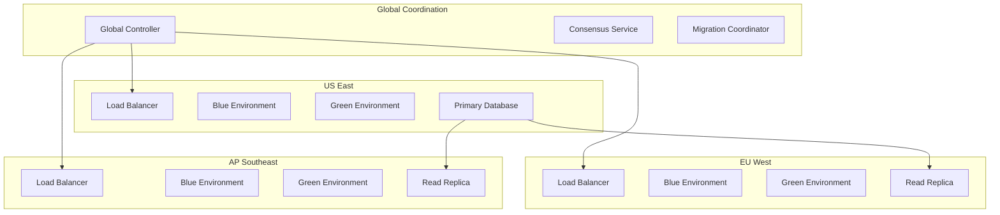

**Implementation Strategy:**

1. **Staged Regional Rollout:**

   ```yaml
   deployment_strategy:
     type: 'regional_blue_green'
     phases:
       - regions: ['us-east-1']
         validation_time: '30m'
       - regions: ['eu-west-1', 'ap-southeast-1']
         validation_time: '15m'
       - regions: ['global']
         final_cutover: true
   ```

2. **Data Consistency Mechanisms:**

   - **Read-after-write consistency:** Direct writes to primary region
   - **Eventual consistency monitoring:** Track replication lag across regions
   - **Consistency barriers:** Wait for minimum replication before proceeding

3. **Traffic Management:**

   ```python
   class GlobalTrafficManager:
       def switch_region(self, region, environment):
           # Check replication lag
           if self.check_replication_lag(region) > threshold:
               raise ReplicationLagError("Cannot switch: data not consistent")

           # Coordinate with other regions
           consensus = self.consensus_service.propose_switch(region, environment)
           if consensus.approved:
               self.execute_switch(region, environment)
   ```

## Question 3: Service Mesh Integration and Circuit Breaker Patterns

**Q:** How would you integrate blue-green deployments with a service mesh like Istio while implementing sophisticated circuit breaker patterns and progressive traffic shifting?

**A:** Service mesh integration adds powerful traffic management capabilities:

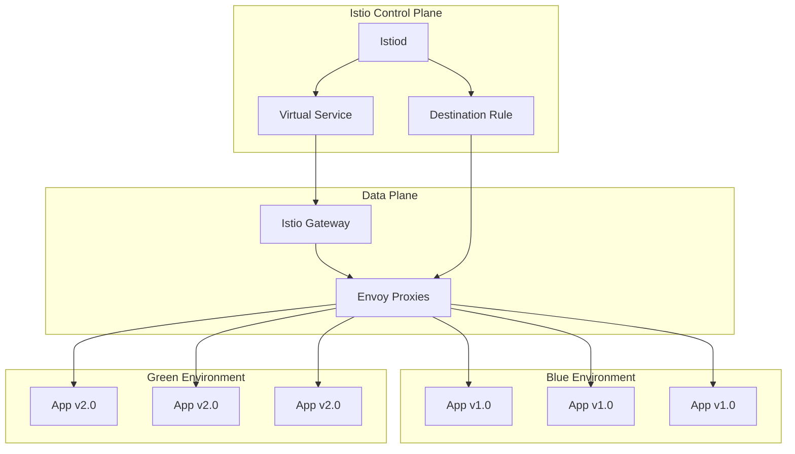

**Istio Configuration Example:**

```yaml
apiVersion: networking.istio.io/v1beta1
kind: VirtualService
metadata:
  name: app-blue-green
spec:
  http:
    - match:
        - headers:
            canary:
              exact: 'true'
      route:
        - destination:
            host: app-service
            subset: green
          weight: 100
    - route:
        - destination:
            host: app-service
            subset: blue
          weight: 90
        - destination:
            host: app-service
            subset: green
          weight: 10
      fault:
        delay:
          percentage:
            value: 0.1
          fixedDelay: 5s
      retries:
        attempts: 3
        perTryTimeout: 3s

---
apiVersion: networking.istio.io/v1beta1
kind: DestinationRule
metadata:
  name: app-destination
spec:
  host: app-service
  trafficPolicy:
    connectionPool:
      tcp:
        maxConnections: 100
      http:
        http1MaxPendingRequests: 50
        maxRequestsPerConnection: 10
    circuitBreaker:
      consecutiveErrors: 3
      interval: 30s
      baseEjectionTime: 30s
      maxEjectionPercent: 50
  subsets:
    - name: blue
      labels:
        environment: blue
      trafficPolicy:
        circuitBreaker:
          consecutiveErrors: 5
    - name: green
      labels:
        environment: green
      trafficPolicy:
        circuitBreaker:
          consecutiveErrors: 2 # More strict for new version
```

**Progressive Traffic Shifting Implementation:**

```python
class IstioBlueGreenController:
    def __init__(self):
        self.istio_client = IstioClient()
        self.metrics_client = PrometheusClient()

    async def progressive_rollout(self, target_version):
        traffic_percentages = [5, 10, 25, 50, 75, 100]

        for percentage in traffic_percentages:
            # Update traffic split
            await self.update_traffic_split('green', percentage)

            # Monitor for 10 minutes
            await self.monitor_health_metrics(duration=600)

            # Check circuit breaker status
            if self.check_circuit_breaker_trips('green') > threshold:
                await self.rollback()
                raise DeploymentFailure("Circuit breaker trips exceeded")

            # Check error rates
            error_rate = self.get_error_rate('green')
            if error_rate > 0.01:  # 1% error rate threshold
                await self.rollback()
                raise DeploymentFailure(f"Error rate {error_rate} exceeded threshold")

    async def update_traffic_split(self, target_env, percentage):
        virtual_service = {
            'spec': {
                'http': [{
                    'route': [
                        {
                            'destination': {'host': 'app-service', 'subset': 'blue'},
                            'weight': 100 - percentage
                        },
                        {
                            'destination': {'host': 'app-service', 'subset': target_env},
                            'weight': percentage
                        }
                    ]
                }]
            }
        }
        await self.istio_client.patch_virtual_service(virtual_service)
```

## Question 4: Cost Optimization in Blue-Green Deployments

**Q:** Blue-green deployments essentially double your infrastructure costs during transitions. How would you design a cost-optimized blue-green strategy for a large-scale application while maintaining deployment safety?

**A:** Cost optimization requires intelligent resource management and timing strategies:

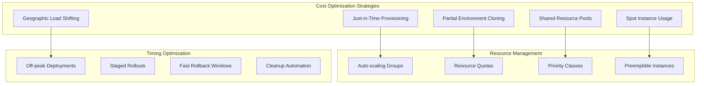

**Cost-Optimized Implementation:**

1. **Just-in-Time Environment Provisioning:**

   ```python
   class CostOptimizedBlueGreen:
       def __init__(self):
           self.cost_threshold = 0.7  # 70% cost increase limit
           self.resource_manager = ResourceManager()

       async def deploy_with_cost_optimization(self, target_env):
           # Calculate current costs
           current_cost = self.calculate_hourly_cost()

           # Determine minimal viable green environment
           green_config = self.optimize_green_environment_size()

           # Use spot instances for non-critical components
           green_config = self.apply_spot_instance_strategy(green_config)

           # Provision green environment
           green_env = await self.provision_environment(green_config)

           # Monitor cost impact
           deployment_cost = self.calculate_deployment_cost(green_env)
           if deployment_cost > current_cost * self.cost_threshold:
               await self.scale_down_non_critical_services()

           return green_env

       def optimize_green_environment_size(self):
           return {
               'frontend': {
                   'replicas': 2,  # Minimum for validation
                   'instance_type': 't3.medium',  # Smaller instances initially
                   'spot_enabled': True
               },
               'backend': {
                   'replicas': 3,  # Critical path
                   'instance_type': 'm5.large',
                   'spot_enabled': False  # Keep on-demand for stability
               },
               'database': {
                   'shared': True  # Reuse existing database
               },
               'cache': {
                   'shared': True  # Reuse existing Redis cluster
               }
           }
   ```

2. **Shared Resource Strategy:**

   ```yaml
   # Shared services configuration
   apiVersion: v1
   kind: ConfigMap
   metadata:
     name: shared-resources-config
   data:
     database_endpoint: "shared-postgres.production.svc.cluster.local"
     redis_endpoint: "shared-redis.production.svc.cluster.local"
     monitoring_endpoint: "shared-prometheus.monitoring.svc.cluster.local"

   # Cost-optimized green deployment
   apiVersion: apps/v1
   kind: Deployment
   metadata:
     name: backend-green-cost-optimized
   spec:
     replicas: 2  # Start with minimal replicas
     template:
       spec:
         nodeSelector:
           node-type: "spot-instance"
         tolerations:
         - key: "spot-instance"
           operator: "Equal"
           value: "true"
           effect: "NoSchedule"
         containers:
         - name: backend
           resources:
             requests:
               memory: "256Mi"  # Reduced initial allocation
               cpu: "200m"
             limits:
               memory: "512Mi"
               cpu: "500m"
   ```

3. **Time-based Cost Optimization:**

   ```python
   class TimeBasedCostOptimizer:
       def __init__(self):
           self.peak_hours = [(9, 17), (19, 22)]  # Business hours
           self.cost_multipliers = {
               'peak': 1.5,
               'off_peak': 0.7,
               'weekend': 0.5
           }

       def get_optimal_deployment_window(self):
           """Find the most cost-effective deployment window"""
           current_hour = datetime.now().hour
           current_day = datetime.now().weekday()

           if current_day >= 5:  # Weekend
               return 'immediate', self.cost_multipliers['weekend']

           if any(start <= current_hour <= end for start, end in self.peak_hours):
               # During peak hours, suggest off-peak deployment
               next_off_peak = self.calculate_next_off_peak_window()
               return next_off_peak, self.cost_multipliers['off_peak']

           return 'immediate', self.cost_multipliers['off_peak']

       async def schedule_cost_optimized_deployment(self, deployment_config):
           optimal_time, cost_multiplier = self.get_optimal_deployment_window()

           if optimal_time != 'immediate':
               print(f"Scheduling deployment for {optimal_time} (Cost savings: {(1-cost_multiplier)*100:.1f}%)")
               await self.schedule_deployment(optimal_time, deployment_config)
           else:
               await self.deploy_immediately(deployment_config)
   ```

## Question 5: Handling Stateful Services in Blue-Green Deployments

**Q:** How do you handle blue-green deployments for stateful services like databases, message queues, or distributed caches where you can't simply duplicate the state?

**A:** Stateful services require specialized patterns that differ significantly from stateless application deployments:

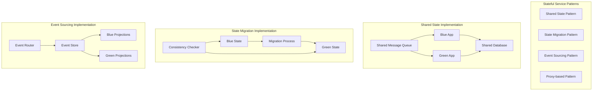

**Implementation Strategies:**

1. **Shared State Pattern (Most Common):**

   ```yaml
   # Database remains shared between environments
   apiVersion: v1
   kind: Service
   metadata:
     name: postgres-shared
   spec:
     selector:
       app: postgres
       tier: shared
     ports:
       - port: 5432

   ---
   # Both blue and green connect to same database
   apiVersion: apps/v1
   kind: Deployment
   metadata:
     name: app-blue
   spec:
     template:
       spec:
         containers:
           - name: app
             env:
               - name: DATABASE_URL
                 value: 'postgres://postgres-shared:5432/myapp'
               - name: MIGRATION_MODE
                 value: 'compatible' # Ensure backward compatibility
   ```

2. **Database Migration Strategy:**

   ```python
   class StatefulBlueGreenManager:
       def __init__(self):
           self.migration_strategies = {
               'postgresql': PostgreSQLMigrationStrategy(),
               'redis': RedisMigrationStrategy(),
               'kafka': KafkaMigrationStrategy()
           }

       async def deploy_with_stateful_services(self, target_env, services):
           migration_plan = self.create_migration_plan(services)

           for service in migration_plan:
               if service.type == 'database':
                   await self.handle_database_migration(service, target_env)
               elif service.type == 'message_queue':
                   await self.handle_message_queue_migration(service, target_env)
               elif service.type == 'cache':
                   await self.handle_cache_migration(service, target_env)

       async def handle_database_migration(self, db_service, target_env):
           """Handle database schema migrations during blue-green deployment"""

           # Step 1: Apply forward-compatible schema changes
           await self.apply_schema_migrations(db_service, mode='forward_compatible')

           # Step 2: Deploy new application version
           await self.deploy_application(target_env)

           # Step 3: Validate new version works with current schema
           validation_result = await self.validate_application_with_schema(target_env)
           if not validation_result.success:
               raise MigrationError("New application incompatible with current schema")

           # Step 4: Switch traffic
           await self.switch_traffic_to_environment(target_env)

           # Step 5: Apply cleanup migrations (remove old columns/tables)
           await asyncio.sleep(3600)  # Wait 1 hour for confidence
           await self.apply_schema_migrations(db_service, mode='cleanup')
   ```

3. **Message Queue Blue-Green Pattern:**

   ```python
   class KafkaBlueGreenStrategy:
       def __init__(self):
           self.kafka_admin = KafkaAdmin()

       async def setup_blue_green_topics(self, deployment_version):
           """Create version-specific topic routing"""

           # Create topics with version suffix
           topics = [
               f"user-events-{deployment_version}",
               f"order-processing-{deployment_version}",
               f"notifications-{deployment_version}"
           ]

           for topic in topics:
               await self.kafka_admin.create_topic(
                   topic,
                   partitions=12,
                   replication_factor=3,
                   config={
                       'retention.ms': '604800000',  # 7 days
                       'compression.type': 'lz4'
                   }
               )

           # Setup topic routing in applications
           await self.configure_application_topic_routing(deployment_version)

       async def migrate_message_queue_traffic(self, from_version, to_version):
           """Gradually migrate message queue traffic"""

           # Start dual-write to both topic versions
           await self.enable_dual_write(from_version, to_version)

           # Migrate consumers to new topics
           await self.migrate_consumers(from_version, to_version)

           # Verify message processing
           await self.verify_message_processing(to_version)

           # Stop dual-write and cleanup old topics
           await self.disable_dual_write(from_version)
           await self.cleanup_old_topics(from_version)
   ```

4. **Redis Cache Blue-Green Strategy:**

   ```python
   class RedisCacheBlueGreenStrategy:
       def __init__(self):
           self.redis_cluster = RedisCluster()

       async def setup_cache_namespacing(self, deployment_version):
           """Use Redis namespacing for blue-green deployments"""

           cache_config = {
               'namespace': f"app:{deployment_version}",
               'ttl_default': 3600,
               'serialization': 'json'
           }

           # Configure application to use versioned cache keys
           await self.configure_cache_client(cache_config)

           # Pre-warm cache for new version
           await self.prewarm_cache(deployment_version)

       async def prewarm_cache(self, version):
           """Pre-populate cache for new deployment version"""

           # Get frequently accessed keys from current version
           hot_keys = await self.get_hot_keys()

           # Copy data to new namespace
           for key in hot_keys:
               old_key = f"app:production:{key}"
               new_key = f"app:{version}:{key}"

               value = await self.redis_cluster.get(old_key)
               if value:
                   await self.redis_cluster.setex(new_key, 3600, value)
   ```

## Question 6: Monitoring and Observability During Blue-Green Deployments

**Q:** Design a comprehensive monitoring and observability strategy for blue-green deployments that can detect subtle issues that might not manifest immediately during the deployment window.

**A:** Comprehensive observability requires multi-layered monitoring with predictive analytics:

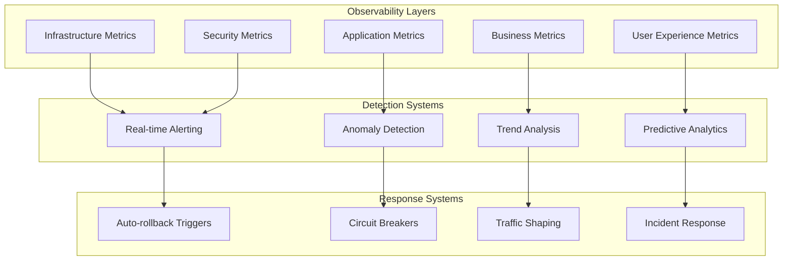

**Comprehensive Monitoring Implementation:**

1. **Multi-dimensional Metrics Collection:**

   ```python
   class BlueGreenObservabilityManager:
       def __init__(self):
           self.metrics_collectors = {
               'infrastructure': InfrastructureMetrics(),
               'application': ApplicationMetrics(),
               'business': BusinessMetrics(),
               'user_experience': UserExperienceMetrics(),
               'security': SecurityMetrics()
           }
           self.anomaly_detector = AnomalyDetector()
           self.alert_manager = AlertManager()

       async def monitor_deployment(self, deployment_id, target_env):
           """Comprehensive monitoring during blue-green deployment"""

           monitoring_config = {
               'deployment_id': deployment_id,
               'target_environment': target_env,
               'baseline_environment': 'blue' if target_env == 'green' else 'green',
               'monitoring_duration': '24h',
               'alert_thresholds': {
                   'error_rate': 0.01,
                   'latency_p99': 2000,  # ms
                   'memory_usage': 0.8,
                   'cpu_usage': 0.7
               }
           }

           # Start monitoring all layers
           monitoring_tasks = []
           for layer, collector in self.metrics_collectors.items():
               task = asyncio.create_task(
                   self.monitor_layer(layer, collector, monitoring_config)
               )
               monitoring_tasks.append(task)

           # Monitor for the specified duration
           await asyncio.gather(*monitoring_tasks)

       async def monitor_layer(self, layer_name, collector, config):
           """Monitor a specific observability layer"""

           baseline_metrics = await collector.get_baseline_metrics(
               config['baseline_environment']
           )

           while True:
               current_metrics = await collector.get_current_metrics(
                   config['target_environment']
               )

               # Compare with baseline
               comparison = self.compare_metrics(baseline_metrics, current_metrics)

               # Run anomaly detection
               anomalies = await self.anomaly_detector.detect(
                   layer_name, current_metrics, baseline_metrics
               )

               # Check for deployment-specific issues
               deployment_issues = await self.check_deployment_health(
                   config, current_metrics
               )

               if anomalies or deployment_issues:
                   await self.handle_issues(anomalies, deployment_issues, config)

               await asyncio.sleep(30)  # Check every 30 seconds
   ```

2. **Advanced Anomaly Detection:**

   ```python
   class DeploymentAnomalyDetector:
       def __init__(self):
           self.ml_models = {
               'time_series': TimeSeriesAnomalyModel(),
               'statistical': StatisticalAnomalyModel(),
               'pattern_recognition': PatternRecognitionModel()
           }

       async def detect_subtle_issues(self, metrics_stream):
           """Detect issues that might not trigger simple threshold alerts"""

           anomalies = []

           # Time series analysis for trending issues
           trending_anomalies = await self.detect_trending_anomalies(metrics_stream)
           anomalies.extend(trending_anomalies)

           # Statistical analysis for distribution changes
           distribution_anomalies = await self.detect_distribution_changes(metrics_stream)
           anomalies.extend(distribution_anomalies)

           # Pattern recognition for complex behavioral changes
           pattern_anomalies = await self.detect_pattern_changes(metrics_stream)
           anomalies.extend(pattern_anomalies)

           # Correlation analysis between metrics
           correlation_anomalies = await self.detect_correlation_breaks(metrics_stream)
           anomalies.extend(correlation_anomalies)

           return self.prioritize_anomalies(anomalies)

       async def detect_trending_anomalies(self, metrics):
           """Detect slowly degrading performance trends"""

           # Example: Gradual memory leak detection
           memory_usage_trend = self.calculate_trend(metrics['memory_usage'], window='1h')

           if memory_usage_trend.slope > 0.05:  # 5% increase per hour
               return [{
                   'type': 'memory_leak_suspected',
                   'severity': 'medium',
                   'confidence': memory_usage_trend.r_squared,
                   'projection': f"Memory will reach 90% in {memory_usage_trend.time_to_threshold} hours"
               }]

           # Example: Gradual performance degradation
           latency_trend = self.calculate_trend(metrics['response_time_p95'], window='2h')

           if latency_trend.slope > 10:  # 10ms increase per hour
               return [{
                   'type': 'performance_degradation',
                   'severity': 'high',
                   'confidence': latency_trend.r_squared,
                   'description': f"P95 latency increasing by {latency_trend.slope:.1f}ms/hour"
               }]

           return []
   ```

3. **Business Metrics Monitoring:**

   ```python
   class BusinessMetricsMonitor:
       def __init__(self):
           self.business_kpis = [
               'conversion_rate',
               'user_engagement',
               'revenue_per_request',
               'customer_satisfaction',
               'feature_adoption_rate'
           ]

       async def monitor_business_impact(self, deployment_config):
           """Monitor business metrics during deployment"""

           business_alerts = []

           for kpi in self.business_kpis:
               baseline = await self.get_baseline_kpi(kpi, lookback='7d')
               current = await self.get_current_kpi(kpi, environment=deployment_config['target_env'])

               # Calculate statistical significance of change
               significance = self.calculate_statistical_significance(baseline, current)

               if significance.p_value < 0.05:  # Statistically significant change
                   change_percent = ((current.mean - baseline.mean) / baseline.mean) * 100

                   alert = {
                       'kpi': kpi,
                       'change_percent': change_percent,
                       'significance': significance.p_value,
                       'confidence_interval': significance.confidence_interval,
                       'sample_size': current.sample_size
                   }

                   if abs(change_percent) > 5:  # 5% change threshold
                       alert['severity'] = 'high' if abs(change_percent) > 15 else 'medium'
                       business_alerts.append(alert)

           return business_alerts
   ```

4. **Prometheus + Grafana Configuration:**

   ```yaml
   # Prometheus configuration for blue-green monitoring
   apiVersion: v1
   kind: ConfigMap
   metadata:
     name: prometheus-blue-green-config
   data:
     prometheus.yml: |
       global:
         scrape_interval: 15s
         evaluation_interval: 15s

       rule_files:
         - "/etc/prometheus/rules/*.yml"

       scrape_configs:
       - job_name: 'blue-green-apps'
         kubernetes_sd_configs:
         - role: pod
         relabel_configs:
         - source_labels: [__meta_kubernetes_pod_label_environment]
           target_label: environment
         - source_labels: [__meta_kubernetes_pod_label_version]
           target_label: version
         - source_labels: [__meta_kubernetes_pod_annotation_prometheus_io_scrape]
           action: keep
           regex: true

   ---
   # Alerting rules for blue-green deployments
   apiVersion: v1
   kind: ConfigMap
   metadata:
     name: blue-green-alerts
   data:
     blue-green.yml: |
       groups:
       - name: blue-green-deployment
         rules:
         - alert: EnvironmentErrorRateHigh
           expr: |
             (
               rate(http_requests_total{status=~"5.."}[5m]) /
               rate(http_requests_total[5m])
             ) > 0.01
           for: 2m
           labels:
             severity: critical
           annotations:
             summary: "High error rate in {{ $labels.environment }} environment"
             description: "Error rate is {{ $value | humanizePercentage }} in {{ $labels.environment }}"
         
         - alert: EnvironmentLatencyHigh
           expr: |
             histogram_quantile(0.95, 
               rate(http_request_duration_seconds_bucket[5m])
             ) > 2.0
           for: 5m
           labels:
             severity: warning
           annotations:
             summary: "High latency in {{ $labels.environment }} environment"
             description: "95th percentile latency is {{ $value }}s in {{ $labels.environment }}"
         
         - alert: EnvironmentComparisonAnomaly
           expr: |
             abs(
               (
                 rate(http_requests_total{environment="green"}[5m]) -
                 rate(http_requests_total{environment="blue"}[5m])
               ) /
               rate(http_requests_total{environment="blue"}[5m])
             ) > 0.20
           for: 3m
           labels:
             severity: warning
           annotations:
             summary: "Significant traffic difference between environments"
             description: "Traffic difference is {{ $value | humanizePercentage }}"
   ```

## Question 7: Security Considerations in Blue-Green Deployments

**Q:** What security implications arise from blue-green deployments, and how would you design security controls that don't interfere with the rapid deployment capabilities?

**A:** Security in blue-green deployments requires specialized approaches due to the dual-environment nature:

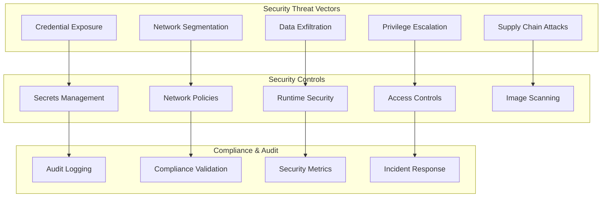

**Security Implementation Strategy:**

1. **Secrets Management for Blue-Green:**

   ```python
   class BlueGreenSecretsManager:
       def __init__(self):
           self.vault_client = VaultClient()
           self.k8s_client = KubernetesClient()

       async def rotate_secrets_during_deployment(self, target_env):
           """Rotate secrets as part of blue-green deployment"""

           # Generate new secrets for the target environment
           new_secrets = await self.generate_environment_secrets(target_env)

           # Deploy secrets to target environment first
           await self.deploy_secrets_to_environment(new_secrets, target_env)

           # Update application configuration to use new secrets
           await self.update_application_secret_refs(target_env, new_secrets)

           # Verify application can access new secrets
           verification_result = await self.verify_secret_access(target_env)
           if not verification_result.success:
               raise SecurityError("Application cannot access new secrets")

           # After successful traffic switch, revoke old secrets
           await self.schedule_secret_revocation(old_secrets, delay='1h')

       async def generate_environment_secrets(self, environment):
           """Generate unique secrets for each environment"""

           secrets = {}

           # Database credentials
           db_password = self.generate_strong_password(32)
           secrets['database'] = {
               'username': f'app_{environment}_{uuid.uuid4().hex[:8]}',
               'password': db_password,
               'connection_string': f'postgresql://.../{environment}_db'
           }

           # API keys
           api_key = self.generate_api_key()
           secrets['external_api'] = {
               'key': api_key,
               'secret': self.generate_api_secret()
           }

           # Encryption keys
           secrets['encryption'] = {
               'key': self.generate_encryption_key(),
               'algorithm': 'AES-256-GCM'
           }

           # Store in Vault with environment-specific path
           vault_path = f'secrets/{environment}'
           await self.vault_client.write(vault_path, secrets)

           return secrets
   ```

2. **Network Security and Segmentation:**

   ```yaml
   # Network policies for blue-green environments
   apiVersion: networking.k8s.io/v1
   kind: NetworkPolicy
   metadata:
     name: blue-green-network-isolation
     namespace: blue-green-webapp
   spec:
     podSelector:
       matchLabels:
         app: webapp
     policyTypes:
       - Ingress
       - Egress
     ingress:
       # Allow traffic from ingress controller
       - from:
           - namespaceSelector:
               matchLabels:
                 name: ingress-nginx
         ports:
           - protocol: TCP
             port: 8080
       # Allow inter-environment communication (for shared services)
       - from:
           - podSelector:
               matchLabels:
                 app: webapp
         ports:
           - protocol: TCP
             port: 8080
     egress:
       # Allow access to shared database
       - to:
           - podSelector:
               matchLabels:
                 app: postgres
                 tier: shared
         ports:
           - protocol: TCP
             port: 5432
       # Allow DNS resolution
       - to: []
         ports:
           - protocol: UDP
             port: 53
       # Allow HTTPS egress for external APIs
       - to: []
         ports:
           - protocol: TCP
             port: 443

   ---
   # Environment-specific security policies
   apiVersion: security.istio.io/v1beta1
   kind: AuthorizationPolicy
   metadata:
     name: blue-environment-access
     namespace: blue-green-webapp
   spec:
     selector:
       matchLabels:
         environment: blue
     rules:
       - from:
           - source:
               principals: ['cluster.local/ns/blue-green-webapp/sa/blue-app']
       - to:
           - operation:
               methods: ['GET', 'POST', 'PUT', 'DELETE']
     when:
       - key: source.labels[environment]
         values: ['blue', 'shared']
   ```

3. **Runtime Security Monitoring:**

   ```python
   class RuntimeSecurityMonitor:
       def __init__(self):
           self.falco_client = FalcoClient()
           self.security_alerts = SecurityAlertManager()

       async def monitor_deployment_security(self, deployment_config):
           """Monitor security events during blue-green deployment"""

           security_rules = [
               'suspicious_network_connections',
               'privilege_escalation_attempts',
               'unauthorized_file_access',
               'crypto_mining_detection',
               'reverse_shell_detection'
           ]

           # Deploy enhanced monitoring for new environment
           await self.deploy_security_monitoring(deployment_config['target_env'], security_rules)

           # Monitor for deployment-specific security issues
           monitoring_task = asyncio.create_task(
               self.continuous_security_monitoring(deployment_config)
           )

           return monitoring_task

       async def continuous_security_monitoring(self, config):
           """Continuously monitor for security anomalies"""

           while True:
               # Check for anomalous network patterns
               network_anomalies = await self.detect_network_anomalies(config['target_env'])

               # Check for privilege escalation
               privilege_issues = await self.detect_privilege_escalation(config['target_env'])

               # Check for data exfiltration patterns
               exfiltration_risks = await self.detect_data_exfiltration(config['target_env'])

               # Correlate security events across environments
               cross_env_threats = await self.correlate_cross_environment_threats()

               all_issues = network_anomalies + privilege_issues + exfiltration_risks + cross_env_threats

               if all_issues:
                   await self.handle_security_incidents(all_issues, config)

               await asyncio.sleep(60)  # Check every minute
   ```

4. **Compliance and Audit Trail:**

   ```python
   class ComplianceManager:
       def __init__(self):
           self.audit_logger = AuditLogger()
           self.compliance_checker = ComplianceChecker()

       async def ensure_deployment_compliance(self, deployment_config):
           """Ensure deployment meets compliance requirements"""

           compliance_checks = [
               'pci_dss_compliance',
               'sox_compliance',
               'gdpr_compliance',
               'hipaa_compliance'  # if applicable
           ]

           audit_event = {
               'event_type': 'blue_green_deployment_start',
               'deployment_id': deployment_config['deployment_id'],
               'target_environment': deployment_config['target_env'],
               'initiated_by': deployment_config['user'],
               'timestamp': datetime.utcnow().isoformat(),
               'compliance_requirements': compliance_checks
           }

           await self.audit_logger.log_event(audit_event)

           # Run compliance checks
           compliance_results = {}
           for check in compliance_checks:
               result = await self.compliance_checker.run_check(check, deployment_config)
               compliance_results[check] = result

               if not result.passed:
                   await self.handle_compliance_failure(check, result, deployment_config)

           # Log compliance results
           audit_event.update({
               'event_type': 'compliance_check_completed',
               'compliance_results': compliance_results
           })
           await self.audit_logger.log_event(audit_event)

           return compliance_results

       async def handle_compliance_failure(self, check_name, result, config):
           """Handle compliance check failures"""

           if check_name == 'pci_dss_compliance':
               # PCI DSS failures might require immediate deployment halt
               await self.emergency_deployment_halt(config, reason=f"PCI DSS compliance failure: {result.message}")

           elif check_name == 'gdpr_compliance':
               # GDPR issues might require data protection measures
               await self.implement_gdpr_safeguards(config, result.details)

           # Always log compliance failures for audit
           await self.audit_logger.log_compliance_failure(check_name, result, config)
   ```

## Question 8: Blue-Green with Microservices Orchestration

**Q:** In a microservices architecture with 20+ services that have complex interdependencies, how would you coordinate blue-green deployments across multiple services while managing version compatibility and dependency relationships?

**A:** Microservices blue-green deployments require sophisticated orchestration and dependency management:

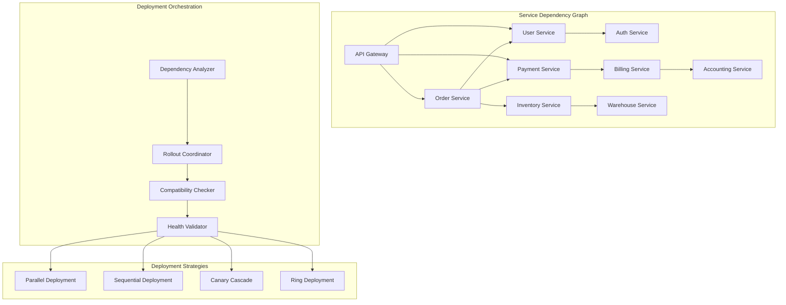

**Microservices Orchestration Implementation:**

1. **Service Dependency Management:**

   ```python
   class MicroservicesBlueGreenOrchestrator:
       def __init__(self):
           self.dependency_graph = ServiceDependencyGraph()
           self.version_compatibility = VersionCompatibilityMatrix()
           self.deployment_coordinator = DeploymentCoordinator()

       async def orchestrate_microservices_deployment(self, deployment_manifest):
           """Orchestrate blue-green deployment across multiple microservices"""

           # Parse deployment manifest
           services_to_deploy = deployment_manifest['services']
           target_environment = deployment_manifest['target_environment']

           # Build deployment plan
           deployment_plan = await self.create_deployment_plan(services_to_deploy)

           # Validate compatibility matrix
           compatibility_check = await self.validate_service_compatibility(deployment_plan)
           if not compatibility_check.valid:
               raise IncompatibleVersionsError(compatibility_check.conflicts)

           # Execute deployment in phases
           for phase in deployment_plan.phases:
               await self.deploy_phase(phase, target_environment)

               # Validate inter-service communication
               await self.validate_inter_service_communication(phase.services, target_environment)

           # Final system-wide validation
           await self.validate_system_health(target_environment)

           return deployment_plan

       async def create_deployment_plan(self, services):
           """Create optimized deployment plan based on dependencies"""

           # Topological sort of service dependencies
           dependency_order = self.dependency_graph.topological_sort(services)

           # Group services that can be deployed in parallel
           deployment_phases = []
           current_phase = []

           for service in dependency_order:
               # Check if service can be deployed in parallel with current phase
               if self.can_deploy_in_parallel(service, current_phase):
                   current_phase.append(service)
               else:
                   # Start new phase
                   if current_phase:
                       deployment_phases.append(DeploymentPhase(current_phase))
                   current_phase = [service]

           if current_phase:
               deployment_phases.append(DeploymentPhase(current_phase))

           return DeploymentPlan(phases=deployment_phases)
   ```

2. **Version Compatibility Matrix:**

   ```python
   class VersionCompatibilityMatrix:
       def __init__(self):
           self.compatibility_rules = self.load_compatibility_rules()

       def load_compatibility_rules(self):
           """Load service version compatibility rules"""
           return {
               'user-service': {
                   'v2.0.0': {
                       'auth-service': ['v1.5.0', 'v1.6.0', 'v2.0.0'],
                       'order-service': ['v1.8.0+'],
                       'api-gateway': ['v3.0.0+']
                   }
               },
               'order-service': {
                   'v1.9.0': {
                       'user-service': ['v1.8.0+'],
                       'payment-service': ['v2.1.0+'],
                       'inventory-service': ['v1.3.0+']
                   }
               },
               'payment-service': {
                   'v2.2.0': {
                       'billing-service': ['v1.7.0+'],
                       'order-service': ['v1.9.0+']
                   }
               }
           }

       async def validate_compatibility(self, deployment_plan):
           """Validate that all service versions are compatible"""

           compatibility_issues = []

           for phase in deployment_plan.phases:
               for service in phase.services:
                   service_name = service.name
                   service_version = service.target_version

                   if service_name in self.compatibility_rules:
                       service_rules = self.compatibility_rules[service_name][service_version]

                       for dependency, required_versions in service_rules.items():
                           # Check if dependency service is being deployed
                           dep_service = deployment_plan.get_service(dependency)
                           if dep_service:
                               dep_version = dep_service.target_version
                           else:
                               # Get current version of dependency
                               dep_version = await self.get_current_service_version(dependency)

                           if not self.version_satisfies(dep_version, required_versions):
                               compatibility_issues.append({
                                   'service': service_name,
                                   'version': service_version,
                                   'dependency': dependency,
                                   'required_versions': required_versions,
                                   'actual_version': dep_version
                               })

           return CompatibilityResult(
               valid=len(compatibility_issues) == 0,
               issues=compatibility_issues
           )
   ```

3. **Deployment Coordination Strategies:**

   ```python
   class DeploymentCoordinator:
       def __init__(self):
           self.strategies = {
               'parallel': ParallelDeploymentStrategy(),
               'sequential': SequentialDeploymentStrategy(),
               'canary_cascade': CanaryCascadeStrategy(),
               'ring': RingDeploymentStrategy()
           }

       async def deploy_phase(self, phase, target_environment, strategy='parallel'):
           """Deploy a phase of services using specified strategy"""

           deployment_strategy = self.strategies[strategy]

           # Pre-deployment validation
           await self.validate_phase_prerequisites(phase, target_environment)

           # Execute deployment strategy
           deployment_results = await deployment_strategy.deploy(phase, target_environment)

           # Post-deployment validation
           await self.validate_phase_deployment(phase, target_environment)

           return deployment_results

   class CanaryCascadeStrategy:
       """Canary deployment that cascades through service dependencies"""

       async def deploy(self, phase, target_environment):
           """Deploy services using canary cascade pattern"""

           results = []

           for service in phase.services:
               # Start with small canary percentage
               canary_percentages = [5, 25, 50, 75, 100]

               for percentage in canary_percentages:
                   # Deploy canary percentage
                   await self.deploy_canary_percentage(service, target_environment, percentage)

                   # Validate canary health
                   health_check = await self.validate_canary_health(service, target_environment)
                   if not health_check.healthy:
                       await self.rollback_canary(service, target_environment)
                       raise CanaryDeploymentError(f"Canary validation failed for {service.name}")

                   # Validate downstream service impact
                   downstream_health = await self.validate_downstream_impact(service, target_environment)
                   if not downstream_health.healthy:
                       await self.rollback_canary(service, target_environment)
                       raise DownstreamImpactError(f"Downstream services affected by {service.name}")

                   # Wait before next percentage increase
                   await asyncio.sleep(300)  # 5 minutes between increases

               results.append(ServiceDeploymentResult(service=service, status='success'))

           return results
   ```

4. **Inter-Service Communication Validation:**

   ```python
   class InterServiceValidator:
       def __init__(self):
           self.service_mesh = ServiceMeshClient()
           self.circuit_breaker = CircuitBreakerManager()

       async def validate_inter_service_communication(self, services, environment):
           """Validate communication between services in new environment"""

           validation_results = []

           for service in services:
               # Get service dependencies
               dependencies = await self.get_service_dependencies(service)

               for dependency in dependencies:
                   # Test communication paths
                   comm_test = await self.test_service_communication(
                       service, dependency, environment
                   )

                   # Test load balancing and failover
                   lb_test = await self.test_load_balancing(
                       service, dependency, environment
                   )

                   # Test circuit breaker behavior
                   cb_test = await self.test_circuit_breaker(
                       service, dependency, environment
                   )

                   validation_result = ServiceCommValidationResult(
                       from_service=service.name,
                       to_service=dependency.name,
                       communication_test=comm_test,
                       load_balancing_test=lb_test,
                       circuit_breaker_test=cb_test
                   )

                   validation_results.append(validation_result)

           return validation_results

       async def test_service_communication(self, from_service, to_service, environment):
           """Test communication between two services"""

           try:
               # Make test API call
               test_endpoint = f"http://{to_service.name}-{environment}:8080/health"
               response = await self.make_service_call(from_service, test_endpoint)

               if response.status_code == 200:
                   return CommTestResult(success=True, latency=response.elapsed)
               else:
                   return CommTestResult(
                       success=False,
                       error=f"HTTP {response.status_code}",
                       latency=response.elapsed
                   )

           except Exception as e:
               return CommTestResult(success=False, error=str(e))
   ```

## Question 9: Database Sharding and Blue-Green Deployments

**Q:** How would you handle blue-green deployments in a system that uses database sharding where different shards may need different migration strategies and some shards are more critical than others?

**A:** Database sharding adds significant complexity to blue-green deployments, requiring shard-aware strategies:

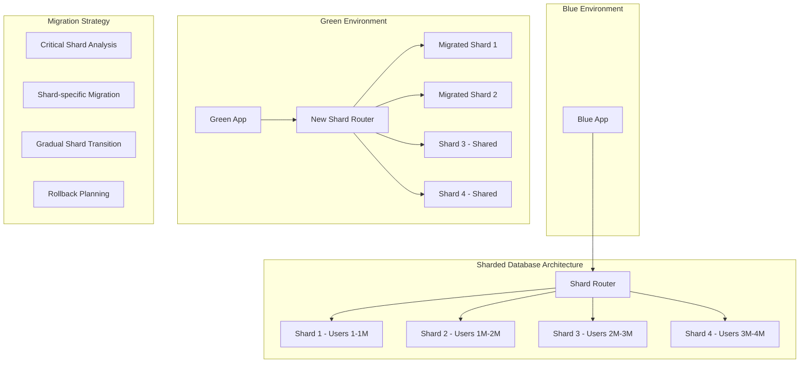

**Shard-Aware Blue-Green Implementation:**

1. **Shard Classification and Strategy Selection:**

   ```python
   class ShardedBlueGreenManager:
       def __init__(self):
           self.shard_classifier = ShardClassifier()
           self.migration_strategies = {
               'critical': CriticalShardStrategy(),
               'standard': StandardShardStrategy(),
               'experimental': ExperimentalShardStrategy()
           }
           self.shard_router = ShardRouter()

       async def deploy_with_sharded_database(self, deployment_config):
           """Deploy application with sharded database considerations"""

           # Analyze shard characteristics
           shard_analysis = await self.analyze_shard_characteristics()

           # Create shard-specific deployment plan
           shard_deployment_plan = await self.create_shard_deployment_plan(
               shard_analysis, deployment_config
           )

           # Execute phased shard migration
           for phase in shard_deployment_plan.phases:
               await self.execute_shard_migration_phase(phase)

               # Validate shard migration
               validation_result = await self.validate_shard_migration(phase)
               if not validation_result.success:
                   await self.rollback_shard_migration(phase)
                   raise ShardMigrationError(validation_result.errors)

           # Update shard routing configuration
           await self.update_shard_routing(deployment_config.target_environment)

           return shard_deployment_plan

       async def analyze_shard_characteristics(self):
           """Analyze each shard to determine migration strategy"""

           shards = await self.shard_router.get_all_shards()
           shard_analysis = {}

           for shard in shards:
               analysis = {
                   'shard_id': shard.id,
                   'data_size': await self.get_shard_data_size(shard),
                   'transaction_volume': await self.get_shard_transaction_volume(shard),
                   'criticality': await self.assess_shard_criticality(shard),
                   'schema_complexity': await self.analyze_schema_complexity(shard),
                   'migration_window': await self.calculate_migration_window(shard)
               }

               # Classify shard based on analysis
               analysis['strategy'] = self.classify_shard_strategy(analysis)
               shard_analysis[shard.id] = analysis

           return shard_analysis

       def classify_shard_strategy(self, analysis):
           """Classify shard migration strategy based on characteristics"""

           if analysis['criticality'] == 'high':
               return 'critical'
           elif analysis['data_size'] > 100_000_000 or analysis['transaction_volume'] > 1000:  # 100M records or 1000 TPS
               return 'standard'
           else:
               return 'experimental'
   ```

2. **Shard-Specific Migration Strategies:**

   ```python
   class CriticalShardStrategy:
       """Conservative strategy for critical shards"""

       async def migrate_shard(self, shard, target_environment):
           """Migrate critical shard with maximum safety"""

           # Create read replica for blue-green
           replica_shard = await self.create_shard_replica(shard)

           # Apply schema migrations to replica
           await self.apply_schema_migrations(replica_shard, mode='safe')

           # Sync data with minimal downtime
           sync_result = await self.sync_shard_data(shard, replica_shard)
           if not sync_result.success:
               raise CriticalShardMigrationError("Data sync failed")

           # Perform final sync with write lock
           async with self.write_lock(shard):
               await self.final_data_sync(shard, replica_shard)

               # Switch shard routing
               await self.switch_shard_routing(shard.id, replica_shard)

           # Validate data consistency
           consistency_check = await self.validate_shard_consistency(replica_shard)
           if not consistency_check.valid:
               await self.emergency_rollback_shard(shard.id)
               raise DataConsistencyError("Shard data consistency validation failed")

           return ShardMigrationResult(
               shard_id=shard.id,
               strategy='critical',
               downtime=sync_result.downtime,
               success=True
           )

   class StandardShardStrategy:
       """Standard strategy for normal shards"""

       async def migrate_shard(self, shard, target_environment):
           """Migrate standard shard with balanced approach"""

           # Use logical replication for data sync
           replication_slot = await self.create_replication_slot(shard)

           # Create new shard with updated schema
           new_shard = await self.create_new_shard(shard, target_environment)

           # Start logical replication
           await self.start_logical_replication(replication_slot, new_shard)

           # Wait for replication to catch up
           await self.wait_for_replication_catchup(replication_slot)

           # Quick cutover
           async with self.brief_write_pause(shard):
               await self.complete_replication_sync(replication_slot, new_shard)
               await self.switch_shard_routing(shard.id, new_shard)

           # Cleanup old shard after validation
           await self.schedule_shard_cleanup(shard, delay='24h')

           return ShardMigrationResult(
               shard_id=shard.id,
               strategy='standard',
               downtime=5,  # seconds
               success=True
           )

   class ExperimentalShardStrategy:
       """Aggressive strategy for non-critical shards"""

       async def migrate_shard(self, shard, target_environment):
           """Migrate experimental shard with minimal overhead"""

           # Direct migration with longer maintenance window
           maintenance_window = await self.schedule_maintenance_window(shard)

           async with maintenance_window:
               # Stop writes to shard
               await self.stop_shard_writes(shard)

               # Apply schema migrations directly
               await self.apply_schema_migrations(shard, mode='aggressive')

               # Update application to use new schema
               await self.update_application_shard_config(shard.id, target_environment)

               # Resume writes
               await self.resume_shard_writes(shard)

           return ShardMigrationResult(
               shard_id=shard.id,
               strategy='experimental',
               downtime=300,  # 5 minutes
               success=True
           )
   ```

3. **Shard Routing Management:**

   ```python
   class ShardRouter:
       def __init__(self):
           self.routing_config = ShardRoutingConfig()
           self.consistent_hash = ConsistentHashRing()

       async def update_shard_routing_for_blue_green(self, target_environment):
           """Update shard routing configuration for blue-green deployment"""

           current_routing = await self.get_current_routing_config()
           new_routing = await self.calculate_new_routing_config(target_environment)

           # Create blue-green routing configuration
           blue_green_routing = {
               'environments': {
                   'blue': current_routing,
                   'green': new_routing
               },
               'active_environment': 'blue',  # Initially
               'routing_strategy': 'environment_based'
           }

           # Deploy new routing configuration
           await self.deploy_routing_config(blue_green_routing)

           # Test routing to green environment
           routing_test = await self.test_shard_routing('green')
           if not routing_test.success:
               raise ShardRoutingError("Green environment routing test failed")

           return blue_green_routing

       async def switch_shard_routing(self, from_env, to_env):
           """Switch shard routing from one environment to another"""

           # Gradual shard routing switch
           shard_groups = await self.get_shard_groups()

           for group in shard_groups:
               # Switch routing for shard group
               await self.switch_shard_group_routing(group, to_env)

               # Validate routing switch
               routing_validation = await self.validate_shard_group_routing(group, to_env)
               if not routing_validation.success:
                   # Rollback this group
                   await self.switch_shard_group_routing(group, from_env)
                   raise ShardGroupRoutingError(f"Routing switch failed for group {group.id}")

               # Wait between group switches
               await asyncio.sleep(30)

           # Update global routing configuration
           await self.update_global_routing_config(to_env)
   ```

4. **Shard-Aware Rollback Strategy:**

   ```python
   class ShardRollbackManager:
       def __init__(self):
           self.shard_snapshots = ShardSnapshotManager()
           self.rollback_strategies = {
               'instant': InstantShardRollback(),
               'gradual': GradualShardRollback(),
               'selective': SelectiveShardRollback()
           }

       async def create_rollback_plan(self, shard_deployment_plan):
           """Create comprehensive rollback plan for sharded deployment"""

           rollback_plan = {
               'shard_snapshots': {},
               'routing_backups': {},
               'rollback_order': [],
               'emergency_procedures': {}
           }

           for phase in shard_deployment_plan.phases:
               for shard_migration in phase.shard_migrations:
                   shard_id = shard_migration.shard_id

                   # Create shard snapshot before migration
                   snapshot = await self.shard_snapshots.create_snapshot(shard_id)
                   rollback_plan['shard_snapshots'][shard_id] = snapshot

                   # Backup routing configuration
                   routing_backup = await self.backup_shard_routing(shard_id)
                   rollback_plan['routing_backups'][shard_id] = routing_backup

                   # Determine rollback strategy based on shard criticality
                   rollback_strategy = self.determine_rollback_strategy(shard_migration)
                   rollback_plan['emergency_procedures'][shard_id] = rollback_strategy

           # Calculate optimal rollback order (reverse dependency order)
           rollback_plan['rollback_order'] = self.calculate_rollback_order(shard_deployment_plan)

           return rollback_plan

       async def execute_emergency_rollback(self, rollback_plan, failed_shard_id=None):
           """Execute emergency rollback for sharded deployment"""

           if failed_shard_id:
               # Selective rollback - only rollback affected shards
               affected_shards = await self.calculate_affected_shards(failed_shard_id)
               shards_to_rollback = [failed_shard_id] + affected_shards
           else:
               # Full rollback
               shards_to_rollback = rollback_plan['rollback_order']

           rollback_results = []

           for shard_id in shards_to_rollback:
               rollback_strategy = rollback_plan['emergency_procedures'][shard_id]

               try:
                   # Execute shard-specific rollback
                   result = await self.rollback_strategies[rollback_strategy].execute_rollback(
                       shard_id, rollback_plan
                   )
                   rollback_results.append(result)

               except Exception as e:
                   # Critical rollback failure
                   await self.handle_critical_rollback_failure(shard_id, e)
                   rollback_results.append(ShardRollbackResult(
                       shard_id=shard_id,
                       success=False,
                       error=str(e)
                   ))

           return rollback_results
   ```

## Question 10: Performance Impact Analysis and Optimization

**Q:** How would you measure and optimize the performance impact of blue-green deployments, especially considering the overhead of running dual environments and the performance characteristics during traffic switches?

**A:** Performance impact analysis requires comprehensive monitoring and optimization strategies:

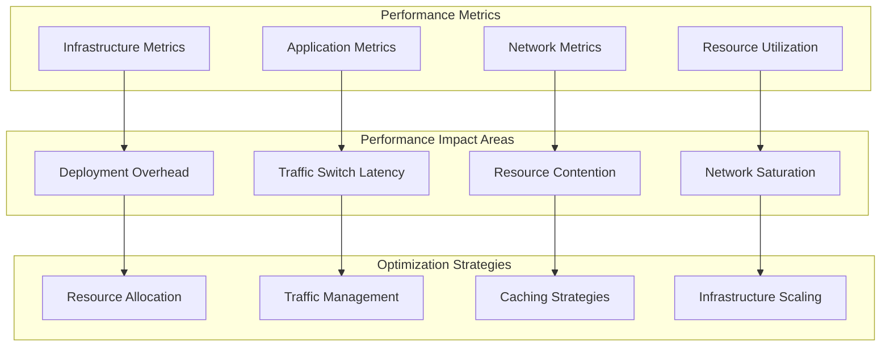

**Performance Analysis and Optimization Implementation:**

1. **Comprehensive Performance Monitoring:**

   ```python
   class BlueGreenPerformanceAnalyzer:
       def __init__(self):
           self.metrics_collector = MetricsCollector()
           self.performance_profiler = PerformanceProfiler()
           self.baseline_manager = BaselineManager()

       async def analyze_deployment_performance_impact(self, deployment_config):
           """Analyze performance impact of blue-green deployment"""

           # Establish baseline metrics
           baseline_metrics = await self.establish_performance_baseline(
               deployment_config.source_environment
           )

           # Monitor performance during deployment
           deployment_metrics = await self.monitor_deployment_performance(
               deployment_config
           )

           # Analyze traffic switch impact
           switch_metrics = await self.analyze_traffic_switch_performance(
               deployment_config
           )

           # Calculate performance impact
           impact_analysis = await self.calculate_performance_impact(
               baseline_metrics, deployment_metrics, switch_metrics
           )

           # Generate optimization recommendations
           optimizations = await self.generate_optimization_recommendations(
               impact_analysis
           )

           return PerformanceAnalysisResult(
               baseline=baseline_metrics,
               deployment=deployment_metrics,
               switch=switch_metrics,
               impact=impact_analysis,
               optimizations=optimizations
           )

       async def establish_performance_baseline(self, environment):
           """Establish performance baseline for comparison"""

           baseline_duration = 3600  # 1 hour baseline

           baseline_metrics = {
               'response_times': await self.collect_response_time_metrics(environment, baseline_duration),
               'throughput': await self.collect_throughput_metrics(environment, baseline_duration),
               'resource_usage': await self.collect_resource_metrics(environment, baseline_duration),
               'error_rates': await self.collect_error_metrics(environment, baseline_duration),
               'dependency_latency': await self.collect_dependency_metrics(environment, baseline_duration)
           }

           # Calculate statistical measures
           for metric_type, data in baseline_metrics.items():
               baseline_metrics[metric_type] = {
                   'raw_data': data,
                   'mean': statistics.mean(data),
                   'median': statistics.median(data),
                   'p95': self.percentile(data, 95),
                   'p99': self.percentile(data, 99),
                   'std_dev': statistics.stdev(data)
               }

           return baseline_metrics
   ```

2. **Traffic Switch Performance Analysis:**

   ```python
   class TrafficSwitchPerformanceAnalyzer:
       def __init__(self):
           self.switch_profiler = TrafficSwitchProfiler()
           self.connection_analyzer = ConnectionAnalyzer()

       async def analyze_traffic_switch_performance(self, switch_config):
           """Analyze performance during traffic switch"""

           switch_metrics = {
               'switch_duration': 0,
               'connection_drops': 0,
               'latency_spike': 0,
               'error_rate_spike': 0,
               'recovery_time': 0
           }

           # Monitor traffic switch process
           switch_start_time = time.time()

           # Pre-switch metrics
           pre_switch_metrics = await self.capture_pre_switch_metrics(switch_config)

           # Execute traffic switch with monitoring
           async with self.switch_performance_monitor(switch_config) as monitor:
               await self.execute_monitored_traffic_switch(switch_config)
               switch_metrics.update(await monitor.get_switch_metrics())

           switch_end_time = time.time()
           switch_metrics['switch_duration'] = switch_end_time - switch_start_time

           # Post-switch metrics
           post_switch_metrics = await self.capture_post_switch_metrics(switch_config)

           # Analyze impact
           impact_analysis = self.analyze_switch_impact(
               pre_switch_metrics, post_switch_metrics, switch_metrics
           )

           return TrafficSwitchAnalysis(
               pre_switch=pre_switch_metrics,
               post_switch=post_switch_metrics,
               switch_metrics=switch_metrics,
               impact=impact_analysis
           )

       async def capture_pre_switch_metrics(self, config):
           """Capture metrics before traffic switch"""

           metrics_window = 300  # 5 minutes before switch

           return {
               'active_connections': await self.count_active_connections(config.source_env),
               'request_rate': await self.measure_request_rate(config.source_env, metrics_window),
               'response_times': await self.measure_response_times(config.source_env, metrics_window),
               'resource_usage': await self.measure_resource_usage(config.source_env),
               'network_throughput': await self.measure_network_throughput(config.source_env)
           }

       @asynccontextmanager
       async def switch_performance_monitor(self, config):
           """Context manager for monitoring during traffic switch"""

           monitor = SwitchPerformanceMonitor()

           # Start monitoring
           monitoring_task = asyncio.create_task(monitor.start_monitoring(config))

           try:
               yield monitor
           finally:
               # Stop monitoring and collect results
               monitoring_task.cancel()
               await monitor.finalize_metrics()
   ```

3. **Resource Optimization Strategies:**

   ```python
   class BlueGreenResourceOptimizer:
       def __init__(self):
           self.resource_analyzer = ResourceAnalyzer()
           self.scaling_optimizer = ScalingOptimizer()
           self.cost_optimizer = CostOptimizer()

       async def optimize_resource_allocation(self, deployment_config, performance_analysis):
           """Optimize resource allocation for blue-green deployment"""

           current_allocation = await self.get_current_resource_allocation(deployment_config)

           # Analyze resource utilization patterns
           utilization_analysis = await self.analyze_resource_utilization(
               deployment_config, performance_analysis
           )

           # Calculate optimal allocation
           optimal_allocation = await self.calculate_optimal_allocation(
               current_allocation, utilization_analysis
           )

           # Generate optimization plan
           optimization_plan = {
               'cpu_optimization': await self.optimize_cpu_allocation(optimal_allocation),
               'memory_optimization': await self.optimize_memory_allocation(optimal_allocation),
               'network_optimization': await self.optimize_network_allocation(optimal_allocation),
               'storage_optimization': await self.optimize_storage_allocation(optimal_allocation)
           }

           return optimization_plan

       async def optimize_cpu_allocation(self, allocation_data):
           """Optimize CPU allocation for both environments"""

           cpu_optimization = {
               'blue_environment': {
                   'current_allocation': allocation_data.blue.cpu,
                   'recommended_allocation': None,
                   'scaling_strategy': None
               },
               'green_environment': {
                   'current_allocation': allocation_data.green.cpu,
                   'recommended_allocation': None,
                   'scaling_strategy': None
               }
           }

           # Analyze CPU usage patterns
           blue_cpu_analysis = await self.analyze_cpu_patterns(allocation_data.blue)
           green_cpu_analysis = await self.analyze_cpu_patterns(allocation_data.green)

           # Calculate recommendations
           if blue_cpu_analysis.utilization > 0.8:  # High utilization
               cpu_optimization['blue_environment']['recommended_allocation'] = \
                   allocation_data.blue.cpu * 1.5
               cpu_optimization['blue_environment']['scaling_strategy'] = 'scale_up'
           elif blue_cpu_analysis.utilization < 0.3:  # Low utilization
               cpu_optimization['blue_environment']['recommended_allocation'] = \
                   allocation_data.blue.cpu * 0.7
               cpu_optimization['blue_environment']['scaling_strategy'] = 'scale_down'

           # Similar analysis for green environment
           if green_cpu_analysis.utilization > 0.8:
               cpu_optimization['green_environment']['recommended_allocation'] = \
                   allocation_data.green.cpu * 1.5
               cpu_optimization['green_environment']['scaling_strategy'] = 'scale_up'
           elif green_cpu_analysis.utilization < 0.3:
               cpu_optimization['green_environment']['recommended_allocation'] = \
                   allocation_data.green.cpu * 0.7
               cpu_optimization['green_environment']['scaling_strategy'] = 'scale_down'

           return cpu_optimization
   ```

4. **Performance Optimization Automation:**

   ```python
   class AutomatedPerformanceOptimizer:
       def __init__(self):
           self.ml_optimizer = MLPerformanceOptimizer()
           self.auto_scaler = AutoScaler()
           self.cache_optimizer = CacheOptimizer()

       async def apply_automated_optimizations(self, deployment_config, performance_data):
           """Apply automated performance optimizations"""

           optimization_tasks = [
               self.optimize_connection_pooling(deployment_config, performance_data),
               self.optimize_caching_strategy(deployment_config, performance_data),
               self.optimize_load_balancing(deployment_config, performance_data),
               self.optimize_database_connections(deployment_config, performance_data)
           ]

           optimization_results = await asyncio.gather(*optimization_tasks)

           return OptimizationResults(
               connection_pooling=optimization_results[0],
               caching=optimization_results[1],
               load_balancing=optimization_results[2],
               database=optimization_results[3]
           )

       async def optimize_connection_pooling(self, config, performance_data):
           """Optimize connection pooling configuration"""

           current_pool_config = await self.get_connection_pool_config(config)

           # Analyze connection patterns
           connection_analysis = self.analyze_connection_patterns(performance_data)

           optimal_pool_size = self.calculate_optimal_pool_size(connection_analysis)
           optimal_timeout = self.calculate_optimal_timeout(connection_analysis)

           new_pool_config = {
               'max_pool_size': optimal_pool_size,
               'min_pool_size': max(1, optimal_pool_size // 4),
               'connection_timeout': optimal_timeout,
               'idle_timeout': optimal_timeout * 2,
               'pool_pre_ping': True  # Ensure connections are valid
           }

           # Apply new configuration
           await self.apply_connection_pool_config(config, new_pool_config)

           return ConnectionPoolOptimizationResult(
               old_config=current_pool_config,
               new_config=new_pool_config,
               expected_improvement='15-25% reduction in connection overhead'
           )

       async def optimize_caching_strategy(self, config, performance_data):
           """Optimize caching strategy for blue-green deployment"""

           cache_analysis = await self.analyze_cache_performance(performance_data)

           optimizations = []

           # Optimize cache warming strategy
           if cache_analysis.hit_rate < 0.8:  # Low hit rate
               cache_warming_strategy = await self.design_cache_warming_strategy(config)
               optimizations.append(cache_warming_strategy)

           # Optimize cache eviction policy
           if cache_analysis.memory_pressure > 0.9:  # High memory pressure
               eviction_optimization = await self.optimize_cache_eviction(config)
               optimizations.append(eviction_optimization)

           # Optimize cache key distribution
           if cache_analysis.key_distribution_skew > 0.3:  # Skewed distribution
               key_distribution_optimization = await self.optimize_key_distribution(config)
               optimizations.append(key_distribution_optimization)

           return CacheOptimizationResult(
               optimizations=optimizations,
               expected_hit_rate_improvement=cache_analysis.potential_improvement
           )
   ```

## Question 11: Edge Computing and CDN Integration

**Q:** How would you implement blue-green deployments for an application that heavily relies on edge computing and CDN distribution, where cache invalidation and edge server updates need to be coordinated globally?

**A:** Edge computing blue-green deployments require sophisticated coordination across geographically distributed infrastructure:

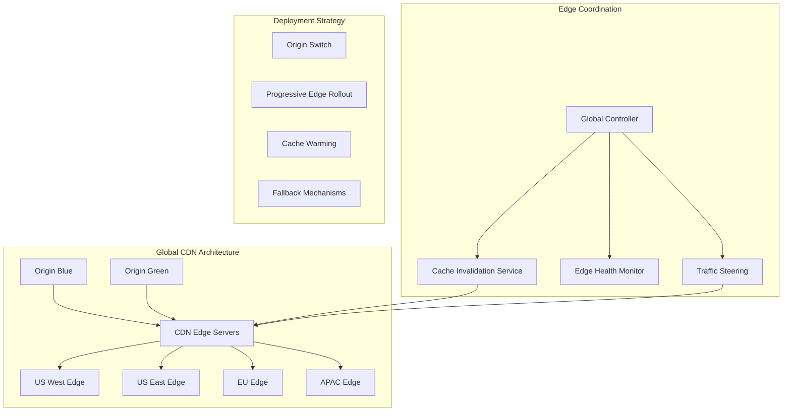

**Edge-Aware Blue-Green Implementation:**

```python
class EdgeBlueGreenOrchestrator:
    def __init__(self):
        self.cdn_manager = CDNManager()
        self.edge_coordinator = EdgeCoordinator()
        self.cache_manager = CacheManager()
        self.traffic_steering = TrafficSteering()

    async def deploy_to_edge_infrastructure(self, deployment_config):
        """Deploy blue-green across edge infrastructure"""

        # Phase 1: Deploy to origin servers
        origin_deployment = await self.deploy_to_origins(deployment_config)

        # Phase 2: Coordinate edge server updates
        edge_deployment = await self.coordinate_edge_deployment(deployment_config)

        # Phase 3: Manage cache invalidation
        cache_strategy = await self.execute_cache_strategy(deployment_config)

        # Phase 4: Progressive traffic steering
        traffic_migration = await self.execute_progressive_traffic_steering(deployment_config)

        return EdgeDeploymentResult(
            origin=origin_deployment,
            edge=edge_deployment,
            cache=cache_strategy,
            traffic=traffic_migration
        )

    async def coordinate_edge_deployment(self, config):
        """Coordinate deployment across edge servers"""

        edge_servers = await self.edge_coordinator.get_all_edge_servers()
        deployment_waves = self.create_edge_deployment_waves(edge_servers)

        wave_results = []

        for wave in deployment_waves:
            # Deploy to wave of edge servers
            wave_result = await self.deploy_edge_wave(wave, config)

            # Validate wave deployment
            validation = await self.validate_edge_wave(wave, config)
            if not validation.success:
                await self.rollback_edge_wave(wave)
                raise EdgeDeploymentError(f"Wave {wave.id} validation failed")

            # Monitor performance impact
            performance_impact = await self.monitor_edge_performance_impact(wave)
            if performance_impact.degradation > 0.1:  # 10% degradation
                await self.rollback_edge_wave(wave)
                raise PerformanceRegressionError(f"Wave {wave.id} caused performance regression")

            wave_results.append(wave_result)

            # Wait between waves for stability
            await asyncio.sleep(300)  # 5 minutes between waves

        return EdgeDeploymentResult(waves=wave_results)

class CacheInvalidationStrategy:
    def __init__(self):
        self.invalidation_strategies = {
            'immediate': ImmediateInvalidation(),
            'progressive': ProgressiveInvalidation(),
            'smart': SmartInvalidation()
        }

    async def execute_smart_cache_invalidation(self, deployment_config):
        """Execute intelligent cache invalidation strategy"""

        # Analyze cache usage patterns
        cache_analysis = await self.analyze_cache_patterns(deployment_config)

        # Identify critical vs non-critical cached content
        cache_prioritization = await self.prioritize_cached_content(cache_analysis)

        invalidation_plan = {
            'critical_content': [],      # Invalidate immediately
            'standard_content': [],      # Invalidate progressively
            'static_content': [],        # Keep cached with versioning
            'user_specific_content': []  # Invalidate per-user
        }

        for content_type, items in cache_prioritization.items():
            if content_type == 'api_responses':
                invalidation_plan['critical_content'].extend(items)
            elif content_type == 'static_assets':
                invalidation_plan['static_content'].extend(items)
            elif content_type == 'user_sessions':
                invalidation_plan['user_specific_content'].extend(items)
            else:
                invalidation_plan['standard_content'].extend(items)

        # Execute invalidation plan
        results = {}

        # Immediate invalidation for critical content
        results['critical'] = await self.immediate_invalidation(
            invalidation_plan['critical_content']
        )

        # Progressive invalidation for standard content
        results['progressive'] = await self.progressive_invalidation(
            invalidation_plan['standard_content']
        )

        # Versioned strategy for static content
        results['versioned'] = await self.versioned_content_strategy(
            invalidation_plan['static_content']
        )

        return CacheInvalidationResult(
            strategy='smart',
            results=results,
            cache_hit_ratio_impact=cache_analysis.projected_impact
        )
```

## Question 12: Compliance and Regulatory Requirements

**Q:** How would you design blue-green deployments for a financial services application that must comply with SOX, PCI-DSS, and other regulatory requirements, including audit trails and change control processes?

**A:** Regulatory compliance adds stringent requirements for audit trails, change control, and validation:

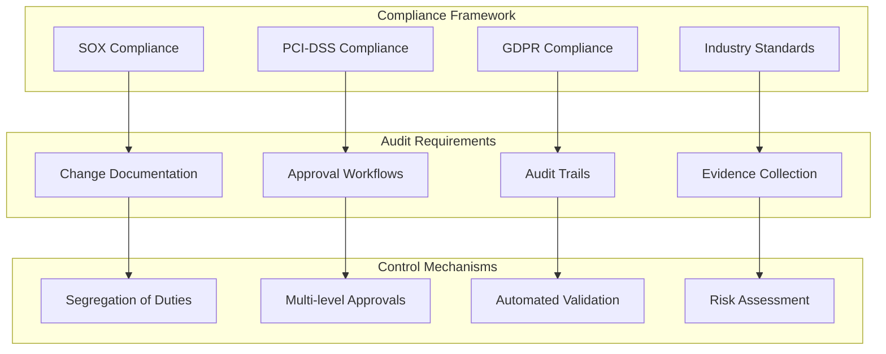

**Compliance-Focused Implementation:**

```python
class ComplianceBlueGreenManager:
    def __init__(self):
        self.audit_logger = ComplianceAuditLogger()
        self.approval_workflow = ApprovalWorkflowManager()
        self.compliance_validator = ComplianceValidator()
        self.evidence_collector = EvidenceCollector()

    async def execute_compliant_deployment(self, deployment_request):
        """Execute blue-green deployment with full compliance controls"""

        # Phase 1: Pre-deployment compliance validation
        compliance_check = await self.validate_pre_deployment_compliance(deployment_request)
        if not compliance_check.approved:
            raise ComplianceViolationError(compliance_check.violations)

        # Phase 2: Change approval workflow
        approval_result = await self.execute_change_approval_workflow(deployment_request)
        if not approval_result.approved:
            raise ChangeNotApprovedException(approval_result.reason)

        # Phase 3: Segregation of duties validation
        sod_validation = await self.validate_segregation_of_duties(deployment_request)
        if not sod_validation.valid:
            raise SegregationOfDutiesViolation(sod_validation.conflicts)

        # Phase 4: Execute deployment with audit logging
        deployment_result = await self.execute_audited_deployment(deployment_request)

        # Phase 5: Post-deployment compliance validation
        post_compliance = await self.validate_post_deployment_compliance(deployment_result)

        # Phase 6: Generate compliance report
        compliance_report = await self.generate_compliance_report(
            deployment_request, deployment_result, post_compliance
        )

        return CompliantDeploymentResult(
            deployment=deployment_result,
            compliance=post_compliance,
            audit_report=compliance_report
        )

    async def validate_pre_deployment_compliance(self, request):
        """Validate compliance requirements before deployment"""

        compliance_checks = {
            'sox_compliance': await self.validate_sox_controls(request),
            'pci_compliance': await self.validate_pci_controls(request),
            'gdpr_compliance': await self.validate_gdpr_controls(request),
            'change_control': await self.validate_change_control_process(request)
        }

        violations = []
        for check_name, result in compliance_checks.items():
            if not result.passed:
                violations.extend(result.violations)

        # Log compliance validation
        await self.audit_logger.log_compliance_validation(
            request.deployment_id,
            compliance_checks,
            violations
        )

        return ComplianceValidationResult(
            approved=len(violations) == 0,
            violations=violations,
            checks=compliance_checks
        )

class SOXComplianceController:
    """Sarbanes-Oxley compliance controls for financial systems"""

    def __init__(self):
        self.control_matrix = SOXControlMatrix()
        self.risk_assessor = RiskAssessor()

    async def validate_sox_controls(self, deployment_request):
        """Validate SOX compliance controls"""

        sox_controls = [
            'ITGC-01: Change Management Controls',
            'ITGC-02: Access Controls and Security',
            'ITGC-03: Computer Operations Controls',
            'ITGC-04: Program Development Controls'
        ]

        validation_results = {}

        for control in sox_controls:
            validation_results[control] = await self.validate_control(
                control, deployment_request
            )

        # Assess overall risk
        risk_assessment = await self.assess_deployment_risk(
            deployment_request, validation_results
        )

        return SOXValidationResult(
            controls=validation_results,
            risk_assessment=risk_assessment,
            approved=all(result.compliant for result in validation_results.values())
        )

    async def validate_control(self, control_id, deployment_request):
        """Validate specific SOX control"""

        if control_id == 'ITGC-01':  # Change Management
            return await self.validate_change_management_control(deployment_request)
        elif control_id == 'ITGC-02':  # Access Controls
            return await self.validate_access_control(deployment_request)
        elif control_id == 'ITGC-03':  # Operations Controls
            return await self.validate_operations_control(deployment_request)
        elif control_id == 'ITGC-04':  # Development Controls
            return await self.validate_development_control(deployment_request)

    async def validate_change_management_control(self, request):
        """Validate change management controls (ITGC-01)"""

        control_checks = []

        # Check 1: Proper authorization
        authorization_check = await self.verify_proper_authorization(request)
        control_checks.append(authorization_check)

        # Check 2: Testing evidence
        testing_evidence = await self.verify_testing_evidence(request)
        control_checks.append(testing_evidence)

        # Check 3: Rollback procedures
        rollback_procedures = await self.verify_rollback_procedures(request)
        control_checks.append(rollback_procedures)

        # Check 4: Impact assessment
        impact_assessment = await self.verify_impact_assessment(request)
        control_checks.append(impact_assessment)

        return ControlValidationResult(
            control_id='ITGC-01',
            checks=control_checks,
            compliant=all(check.passed for check in control_checks)
        )

class PCIDSSComplianceValidator:
    """PCI-DSS compliance validation for payment systems"""

    async def validate_pci_controls(self, deployment_request):
        """Validate PCI-DSS compliance requirements"""

        pci_requirements = [
            'Requirement 1: Firewall Configuration',
            'Requirement 2: Default Password Changes',
            'Requirement 3: Cardholder Data Protection',
            'Requirement 4: Data Transmission Encryption',
            'Requirement 6: Secure Application Development',
            'Requirement 8: Access Control Measures',
            'Requirement 10: Network Monitoring',
            'Requirement 11: Security Testing'
        ]

        validation_results = {}

        for requirement in pci_requirements:
            validation_results[requirement] = await self.validate_pci_requirement(
                requirement, deployment_request
            )

        # Special focus on Requirement 6 for deployments
        req6_detailed = await self.detailed_requirement_6_validation(deployment_request)

        return PCIValidationResult(
            requirements=validation_results,
            requirement_6_detail=req6_detailed,
            compliance_level=self.calculate_compliance_level(validation_results)
        )

    async def detailed_requirement_6_validation(self, request):
        """Detailed validation of PCI Requirement 6 (Secure Development)"""

        req6_checks = {
            '6.1': await self.check_vulnerability_management(request),
            '6.2': await self.check_security_patches(request),
            '6.3': await self.check_secure_development_processes(request),
            '6.4': await self.check_change_control_procedures(request),
            '6.5': await self.check_common_vulnerabilities(request),
            '6.6': await self.check_application_layer_security(request),
            '6.7': await self.check_development_production_separation(request)
        }

        return Requirement6ValidationResult(
            checks=req6_checks,
            compliant=all(check.passed for check in req6_checks.values())
        )

class AuditTrailManager:
    """Comprehensive audit trail management for compliance"""

    def __init__(self):
        self.audit_storage = ComplianceAuditStorage()
        self.integrity_verifier = AuditIntegrityVerifier()

    async def create_deployment_audit_trail(self, deployment_request):
        """Create comprehensive audit trail for deployment"""

        audit_trail = {
            'deployment_id': deployment_request.deployment_id,
            'initiated_by': deployment_request.user_id,
            'timestamp': datetime.utcnow().isoformat(),
            'request_details': self.sanitize_request_details(deployment_request),
            'approval_chain': [],
            'technical_validations': [],
            'compliance_checks': [],
            'deployment_steps': [],
            'verification_results': [],
            'risk_assessments': []
        }

        # Store initial audit entry
        audit_id = await self.audit_storage.store_audit_entry(audit_trail)

        # Create audit trail context for the deployment
        return AuditTrailContext(audit_id, audit_trail)

    async def log_approval_step(self, audit_context, approval_step):
        """Log approval step in audit trail"""

        approval_entry = {
            'step_id': approval_step.step_id,
            'approver_id': approval_step.approver_id,
            'approval_timestamp': datetime.utcnow().isoformat(),
            'approval_decision': approval_step.decision,
            'approval_comments': approval_step.comments,
            'approver_role': approval_step.approver_role,
            'segregation_validation': approval_step.segregation_check
        }

        audit_context.audit_trail['approval_chain'].append(approval_entry)

        # Update stored audit trail
        await self.audit_storage.update_audit_entry(
            audit_context.audit_id,
            audit_context.audit_trail
        )

        # Verify audit integrity
        await self.integrity_verifier.verify_audit_integrity(audit_context.audit_id)

    async def generate_compliance_report(self, audit_context):
        """Generate comprehensive compliance report"""

        report = {
            'report_id': str(uuid.uuid4()),
            'generated_at': datetime.utcnow().isoformat(),
            'deployment_summary': self.create_deployment_summary(audit_context),
            'compliance_summary': self.create_compliance_summary(audit_context),
            'risk_assessment': self.create_risk_assessment(audit_context),
            'approval_summary': self.create_approval_summary(audit_context),
            'technical_validation': self.create_technical_validation_summary(audit_context),
            'evidence_collection': self.create_evidence_summary(audit_context),
            'recommendations': self.create_recommendations(audit_context)
        }

        # Sign report for integrity
        signed_report = await self.integrity_verifier.sign_report(report)

        # Store report for regulatory purposes
        await self.audit_storage.store_compliance_report(signed_report)

        return signed_report
```

## Question 13: Container Orchestration and Resource Management

**Q:** In a Kubernetes environment with resource constraints and multiple teams sharing the cluster, how would you design blue-green deployments that efficiently manage resource allocation while ensuring fair sharing and preventing resource starvation?

**A:** Multi-tenant Kubernetes blue-green deployments require sophisticated resource management:

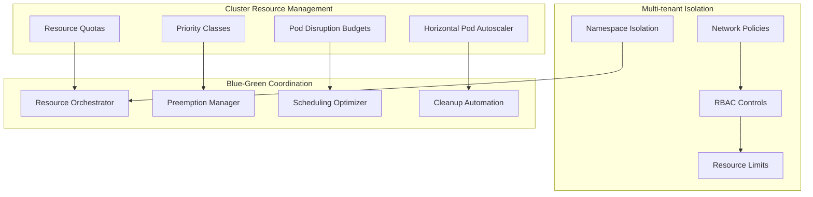

**Resource-Aware Implementation:**

```python
class KubernetesBlueGreenResourceManager:
    def __init__(self):
        self.k8s_client = KubernetesClient()
        self.resource_analyzer = ResourceAnalyzer()
        self.scheduler_optimizer = SchedulerOptimizer()
        self.quota_manager = ResourceQuotaManager()

    async def deploy_with_resource_constraints(self, deployment_config):
        """Deploy blue-green with intelligent resource management"""

        # Analyze current cluster resource usage
        cluster_analysis = await self.analyze_cluster_resources()

        # Calculate resource requirements for green environment
        green_requirements = await self.calculate_green_environment_requirements(
            deployment_config
        )

        # Check resource availability
        availability_check = await self.check_resource_availability(
            cluster_analysis, green_requirements
        )

        if not availability_check.sufficient:
            # Attempt resource optimization
            optimization_plan = await self.create_resource_optimization_plan(
                cluster_analysis, green_requirements
            )
            await self.execute_resource_optimization(optimization_plan)

        # Deploy with resource-aware scheduling
        deployment_result = await self.deploy_with_smart_scheduling(
            deployment_config, green_requirements
        )

        return deployment_result

    async def analyze_cluster_resources(self):
        """Analyze current cluster resource utilization"""

        # Get node resource capacity and usage
        nodes = await self.k8s_client.list_nodes()
        node_metrics = await self.k8s_client.get_node_metrics()

        cluster_analysis = {
            'total_capacity': {'cpu': 0, 'memory': 0, 'storage': 0},
            'total_allocated': {'cpu': 0, 'memory': 0, 'storage': 0},
            'total_used': {'cpu': 0, 'memory': 0, 'storage': 0},
            'per_node_analysis': {},
            'resource_pressure': {}
        }

        for node in nodes:
            node_name = node.metadata.name
            node_capacity = node.status.capacity
            node_allocatable = node.status.allocatable

            # Get current usage from metrics
            node_usage = node_metrics.get(node_name, {})

            # Calculate resource pressure
            cpu_pressure = float(node_usage.get('cpu', 0)) / float(node_allocatable.get('cpu', 1))
            memory_pressure = float(node_usage.get('memory', 0)) / float(node_allocatable.get('memory', 1))

            cluster_analysis['per_node_analysis'][node_name] = {
                'capacity': node_capacity,
                'allocatable': node_allocatable,
                'usage': node_usage,
                'cpu_pressure': cpu_pressure,
                'memory_pressure': memory_pressure,
                'available_for_scheduling': {
                    'cpu': float(node_allocatable.get('cpu', 0)) - float(node_usage.get('cpu', 0)),
                    'memory': float(node_allocatable.get('memory', 0)) - float(node_usage.get('memory', 0))
                }
            }

            # Aggregate cluster totals
            cluster_analysis['total_capacity']['cpu'] += float(node_capacity.get('cpu', 0))
            cluster_analysis['total_capacity']['memory'] += float(node_capacity.get('memory', 0))
            cluster_analysis['total_used']['cpu'] += float(node_usage.get('cpu', 0))
            cluster_analysis['total_used']['memory'] += float(node_usage.get('memory', 0))

        # Calculate overall cluster pressure
        cluster_analysis['resource_pressure'] = {
            'cpu': cluster_analysis['total_used']['cpu'] / cluster_analysis['total_capacity']['cpu'],
            'memory': cluster_analysis['total_used']['memory'] / cluster_analysis['total_capacity']['memory']
        }

        return cluster_analysis

class ResourceOptimizationManager:
    def __init__(self):
        self.preemption_manager = PreemptionManager()
        self.vertical_scaler = VerticalPodAutoscaler()
        self.resource_reclaimer = ResourceReclaimer()

    async def create_resource_optimization_plan(self, cluster_analysis, requirements):
        """Create comprehensive resource optimization plan"""

        optimization_strategies = []

        # Strategy 1: Identify over-allocated pods
        over_allocated_pods = await self.identify_over_allocated_pods(cluster_analysis)
        if over_allocated_pods:
            optimization_strategies.append({
                'type': 'vertical_scaling_down',
                'target_pods': over_allocated_pods,
                'potential_savings': self.calculate_potential_savings(over_allocated_pods)
            })

        # Strategy 2: Identify preemptible workloads
        preemptible_workloads = await self.identify_preemptible_workloads(cluster_analysis)
        if preemptible_workloads:
            optimization_strategies.append({
                'type': 'workload_preemption',
                'target_workloads': preemptible_workloads,
                'freed_resources': self.calculate_freed_resources(preemptible_workloads)
            })

        # Strategy 3: Optimize resource requests/limits
        optimization_candidates = await self.identify_optimization_candidates(cluster_analysis)
        if optimization_candidates:
            optimization_strategies.append({
                'type': 'request_limit_optimization',
                'target_pods': optimization_candidates,
                'optimization_potential': self.calculate_optimization_potential(optimization_candidates)
            })

        # Strategy 4: Intelligent pod placement
        placement_optimization = await self.calculate_optimal_placement(requirements, cluster_analysis)
        optimization_strategies.append({
            'type': 'intelligent_placement',
            'placement_strategy': placement_optimization
        })

        return ResourceOptimizationPlan(strategies=optimization_strategies)

class SmartSchedulingManager:
    def __init__(self):
        self.scheduler = AdvancedScheduler()
        self.affinity_manager = AffinityManager()

    async def deploy_with_smart_scheduling(self, deployment_config, resource_requirements):
        """Deploy with intelligent scheduling strategies"""

        # Create smart scheduling configuration
        scheduling_config = await self.create_scheduling_config(
            deployment_config, resource_requirements
        )

        # Deploy pods with intelligent placement
        deployment_result = await self.deploy_with_scheduling_config(
            deployment_config, scheduling_config
        )

        return deployment_result

    async def create_scheduling_config(self, deployment_config, requirements):
        """Create intelligent scheduling configuration"""

        scheduling_config = {
            'node_affinity': await self.calculate_optimal_node_affinity(requirements),
            'pod_anti_affinity': await self.create_pod_anti_affinity_rules(deployment_config),
            'priority_class': await self.determine_priority_class(deployment_config),
            'resource_requests': await self.optimize_resource_requests(requirements),
            'resource_limits': await self.calculate_resource_limits(requirements),
            'topology_spread_constraints': await self.create_topology_constraints(deployment_config)
        }

        return scheduling_config

    async def calculate_optimal_node_affinity(self, requirements):
        """Calculate optimal node affinity based on resource requirements"""

        # Analyze node characteristics
        nodes = await self.k8s_client.list_nodes()
        node_scores = {}

        for node in nodes:
            score = 0

            # Score based on available resources
            available_cpu = float(node.status.allocatable.get('cpu', 0))
            available_memory = float(node.status.allocatable.get('memory', 0))

            if available_cpu >= requirements['cpu'] * 1.2:  # 20% buffer
                score += 10
            if available_memory >= requirements['memory'] * 1.2:
                score += 10

            # Score based on node labels (instance type, zone, etc.)
            instance_type = node.metadata.labels.get('node.kubernetes.io/instance-type', '')
            if 'compute-optimized' in instance_type and requirements['cpu_intensive']:
                score += 15
            if 'memory-optimized' in instance_type and requirements['memory_intensive']:
                score += 15

            # Score based on current utilization
            current_utilization = await self.get_node_utilization(node.metadata.name)
            if current_utilization['cpu'] < 0.7:  # Less than 70% CPU utilization
                score += 5
            if current_utilization['memory'] < 0.7:
                score += 5

            node_scores[node.metadata.name] = score

        # Create node affinity rules based on scores
        preferred_nodes = sorted(node_scores.items(), key=lambda x: x[1], reverse=True)[:3]

        node_affinity = {
            'requiredDuringSchedulingIgnoredDuringExecution': {
                'nodeSelectorTerms': [{
                    'matchExpressions': [{
                        'key': 'kubernetes.io/arch',
                        'operator': 'In',
                        'values': ['amd64']
                    }]
                }]
            },
            'preferredDuringSchedulingIgnoredDuringExecution': [
                {
                    'weight': 100 - (i * 20),
                    'preference': {
                        'matchExpressions': [{
                            'key': 'kubernetes.io/hostname',
                            'operator': 'In',
                            'values': [node_name]
                        }]
                    }
                }
                for i, (node_name, score) in enumerate(preferred_nodes)
            ]
        }

        return node_affinity

class ResourceQuotaManager:
    def __init__(self):
        self.quota_calculator = QuotaCalculator()
        self.burst_manager = BurstCapacityManager()

    async def manage_blue_green_quotas(self, deployment_config):
        """Manage resource quotas for blue-green deployment"""

        namespace = deployment_config.namespace

        # Get current quota usage
        current_quota = await self.k8s_client.get_resource_quota(namespace)
        current_usage = await self.k8s_client.get_quota_usage(namespace)

        # Calculate additional quota needed for green environment
        green_requirements = await self.calculate_green_quota_requirements(deployment_config)

        # Check if burst capacity is needed
        burst_needed = self.calculate_burst_requirements(current_usage, green_requirements)

        if burst_needed['required']:
            # Request burst capacity
            burst_approval = await self.request_burst_capacity(
                namespace, burst_needed['amount'], deployment_config
            )

            if burst_approval.approved:
                # Temporarily increase quota
                await self.apply_burst_quota(namespace, burst_needed['amount'])

                # Schedule quota cleanup after deployment
                await self.schedule_quota_cleanup(
                    namespace, burst_needed['amount'], delay='2h'
                )

        return QuotaManagementResult(
            burst_applied=burst_needed['required'],
            burst_amount=burst_needed.get('amount', {}),
            cleanup_scheduled=burst_needed['required']
        )
```

## Question 14: Handling Legacy Systems and Technical Debt

**Q:** How would you approach blue-green deployments for a legacy monolithic application that has significant technical debt, including tightly coupled components, shared mutable state, and no clear API boundaries?

**A:** Legacy system blue-green deployments require specialized strategies to handle technical constraints:

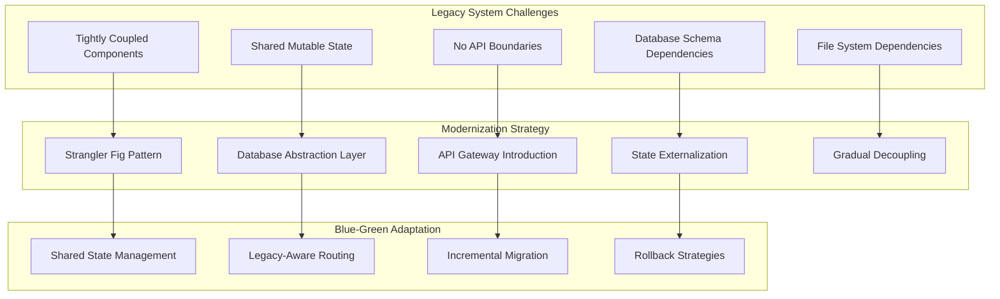

**Legacy-Aware Blue-Green Implementation:**

```python
class LegacyBlueGreenManager:
    def __init__(self):
        self.legacy_analyzer = LegacySystemAnalyzer()
        self.state_manager = SharedStateManager()
        self.modernization_planner = ModernizationPlanner()
        self.compatibility_checker = CompatibilityChecker()

    async def analyze_legacy_system_constraints(self, system_config):
        """Analyze legacy system to identify blue-green deployment constraints"""

        analysis_result = {
            'coupling_analysis': await self.analyze_component_coupling(system_config),
            'state_dependencies': await self.analyze_state_dependencies(system_config),
            'file_system_dependencies': await self.analyze_file_dependencies(system_config),
            'database_constraints': await self.analyze_database_constraints(system_config),
            'external_integrations': await self.analyze_external_integrations(system_config),
            'modernization_recommendations': []
        }

        # Generate modernization recommendations
        analysis_result['modernization_recommendations'] = \
            await self.generate_modernization_plan(analysis_result)

        return LegacySystemAnalysis(**analysis_result)

    async def implement_strangler_fig_deployment(self, deployment_config, legacy_analysis):
        """Implement blue-green using strangler fig pattern"""

        # Identify components that can be safely strangled
        strangleable_components = await self.identify_strangleable_components(legacy_analysis)

        # Create modernization phases
        modernization_phases = await self.create_modernization_phases(
            strangleable_components, deployment_config
        )

        deployment_results = []

        for phase in modernization_phases:
            # Deploy modern version of components in this phase
            phase_result = await self.deploy_modernization_phase(phase, deployment_config)

            # Gradually route traffic to modern components
            routing_result = await self.implement_gradual_traffic_routing(phase, deployment_config)

            # Validate legacy system compatibility
            compatibility_result = await self.validate_legacy_compatibility(phase)

            if not compatibility_result.compatible:
                # Rollback this phase
                await self.rollback_modernization_phase(phase)
                raise LegacyCompatibilityError(compatibility_result.issues)

            deployment_results.append(ModernizationPhaseResult(
                phase=phase,
                deployment=phase_result,
                routing=routing_result,
                compatibility=compatibility_result
            ))

        return StranglerFigDeploymentResult(phases=deployment_results)

class SharedStateManager:
    """Manage shared state during legacy blue-green deployments"""

    def __init__(self):
        self.state_synchronizer = StateSynchronizer()
        self.session_manager = SessionManager()
        self.file_system_manager = FileSystemManager()

    async def implement_shared_state_strategy(self, legacy_analysis, deployment_config):
        """Implement strategy for handling shared state"""

        state_strategies = {}

        # Handle database shared state
        if legacy_analysis.database_constraints.shared_tables:
            state_strategies['database'] = await self.implement_database_state_strategy(
                legacy_analysis.database_constraints
            )

        # Handle file system shared state
        if legacy_analysis.file_system_dependencies.shared_files:
            state_strategies['filesystem'] = await self.implement_filesystem_state_strategy(
                legacy_analysis.file_system_dependencies
            )

        # Handle in-memory shared state
        if legacy_analysis.state_dependencies.in_memory_state:
            state_strategies['memory'] = await self.implement_memory_state_strategy(
                legacy_analysis.state_dependencies
            )

        # Handle session state
        if legacy_analysis.state_dependencies.session_state:
            state_strategies['session'] = await self.implement_session_state_strategy(
                legacy_analysis.state_dependencies
            )

        return SharedStateStrategy(strategies=state_strategies)

    async def implement_database_state_strategy(self, db_constraints):
        """Implement database state management strategy"""

        if db_constraints.migration_complexity == 'high':
            # Use database views for backward compatibility
            strategy = DatabaseViewStrategy()

            # Create compatibility views
            compatibility_views = await strategy.create_compatibility_views(db_constraints)

            # Implement dual-write pattern for transitional period
            dual_write_config = await strategy.setup_dual_write_pattern(db_constraints)

            return DatabaseStateStrategy(
                type='views_and_dual_write',
                views=compatibility_views,
                dual_write=dual_write_config
            )

        elif db_constraints.migration_complexity == 'medium':
            # Use database triggers for data synchronization
            strategy = DatabaseTriggerStrategy()

            sync_triggers = await strategy.create_sync_triggers(db_constraints)

            return DatabaseStateStrategy(
                type='trigger_based_sync',
                triggers=sync_triggers
            )

        else:
            # Simple shared database approach
            return DatabaseStateStrategy(
                type='shared_database',
                shared_connection_config=await self.create_shared_db_config(db_constraints)
            )

class LegacyCompatibilityProxy:
    """Proxy layer to handle legacy system compatibility"""

    def __init__(self):
        self.protocol_adapter = ProtocolAdapter()
        self.data_transformer = DataTransformer()
        self.error_handler = LegacyErrorHandler()

    async def create_compatibility_layer(self, legacy_analysis, modern_config):
        """Create compatibility layer between legacy and modern components"""

        compatibility_layer = {
            'protocol_adapters': [],
            'data_transformers': [],
            'error_mappers': [],
            'performance_buffers': []
        }

        # Create protocol adapters
        for integration in legacy_analysis.external_integrations:
            if integration.protocol != modern_config.preferred_protocol:
                adapter = await self.protocol_adapter.create_adapter(
                    integration.protocol, modern_config.preferred_protocol
                )
                compatibility_layer['protocol_adapters'].append(adapter)

        # Create data transformers
        for data_format in legacy_analysis.data_formats:
            if data_format.format != modern_config.preferred_format:
                transformer = await self.data_transformer.create_transformer(
                    data_format.format, modern_config.preferred_format
                )
                compatibility_layer['data_transformers'].append(transformer)

        # Create error mappers
        error_mapper = await self.error_handler.create_error_mapper(
            legacy_analysis.error_patterns, modern_config.error_handling
        )
        compatibility_layer['error_mappers'].append(error_mapper)

        return CompatibilityLayer(**compatibility_layer)

class IncrementalMigrationManager:
    """Manage incremental migration of legacy components"""

    def __init__(self):
        self.component_analyzer = ComponentAnalyzer()
        self.dependency_resolver = DependencyResolver()
        self.risk_assessor = MigrationRiskAssessor()

    async def create_incremental_migration_plan(self, legacy_analysis):
        """Create incremental migration plan for legacy system"""

        # Analyze component dependencies
        dependency_graph = await self.component_analyzer.build_dependency_graph(legacy_analysis)

        # Identify migration order based on dependencies and risk
        migration_order = await self.calculate_optimal_migration_order(dependency_graph)

        # Create migration phases
        migration_phases = []
        current_phase_components = []

        for component in migration_order:
            # Check if component can be migrated in current phase
            can_migrate_together = await self.can_migrate_together(
                component, current_phase_components, dependency_graph
            )

            if can_migrate_together:
                current_phase_components.append(component)
            else:
                # Start new phase
                if current_phase_components:
                    migration_phases.append(MigrationPhase(
                        components=current_phase_components,
                        risk_level=await self.assess_phase_risk(current_phase_components),
                        estimated_duration=await self.estimate_phase_duration(current_phase_components)
                    ))
                current_phase_components = [component]

        # Add final phase
        if current_phase_components:
            migration_phases.append(MigrationPhase(
                components=current_phase_components,
                risk_level=await self.assess_phase_risk(current_phase_components),
                estimated_duration=await self.estimate_phase_duration(current_phase_components)
            ))

        return IncrementalMigrationPlan(
            phases=migration_phases,
            total_estimated_duration=sum(phase.estimated_duration for phase in migration_phases),
            overall_risk_assessment=await self.assess_overall_migration_risk(migration_phases)
        )

    async def execute_migration_phase(self, phase, deployment_config):
        """Execute a single migration phase"""

        phase_result = {
            'components_migrated': [],
            'compatibility_issues': [],
            'performance_impact': {},
            'rollback_checkpoints': []
        }

        for component in phase.components:
            # Create rollback checkpoint
            checkpoint = await self.create_rollback_checkpoint(component)
            phase_result['rollback_checkpoints'].append(checkpoint)

            try:
                # Migrate component
                migration_result = await self.migrate_component(component, deployment_config)

                # Validate migration
                validation_result = await self.validate_component_migration(component)

                if validation_result.success:
                    phase_result['components_migrated'].append(component)
                else:
                    # Rollback component migration
                    await self.rollback_component_migration(component, checkpoint)
                    phase_result['compatibility_issues'].extend(validation_result.issues)

            except Exception as e:
                # Emergency rollback
                await self.emergency_rollback_component(component, checkpoint)
                phase_result['compatibility_issues'].append({
                    'component': component.name,
                    'error': str(e),
                    'severity': 'high'
                })

        return MigrationPhaseResult(**phase_result)
```

## Question 15: Testing Strategies for Blue-Green Deployments

**Q:** Design a comprehensive testing strategy for blue-green deployments that includes automated testing, chaos engineering, and production-like validation while minimizing the risk of deploying defective code to the green environment.

**A:** Comprehensive testing requires multi-layered validation strategies:

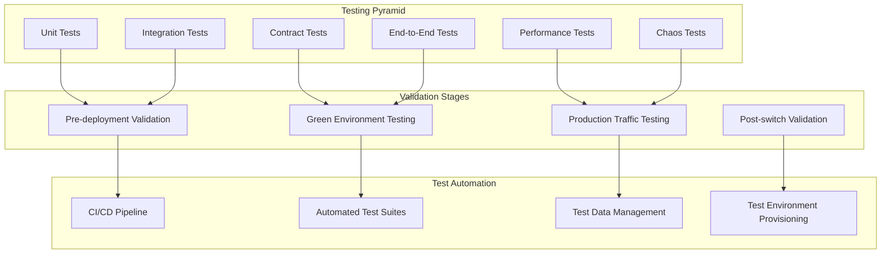

**Comprehensive Testing Implementation:**

```python
class BlueGreenTestingOrchestrator:
    def __init__(self):
        self.test_suite_manager = TestSuiteManager()
        self.chaos_engineer = ChaosEngineer()
        self.performance_tester = PerformanceTester()
        self.production_validator = ProductionValidator()

    async def execute_comprehensive_testing_strategy(self, deployment_config):
        """Execute comprehensive testing strategy for blue-green deployment"""

        testing_strategy = {
            'pre_deployment': await self.execute_pre_deployment_testing(deployment_config),
            'green_environment': await self.execute_green_environment_testing(deployment_config),
            'production_traffic': await self.execute_production_traffic_testing(deployment_config),
            'chaos_engineering': await self.execute_chaos_testing(deployment_config),
            'performance_validation': await self.execute_performance_testing(deployment_config),
            'security_testing': await self.execute_security_testing(deployment_config)
        }

        # Validate all testing phases passed
        overall_result = await self.validate_testing_results(testing_strategy)

        if not overall_result.passed:
            raise TestingValidationError(overall_result.failures)

        return ComprehensiveTestingResult(
            strategy=testing_strategy,
            overall_result=overall_result,
            deployment_recommendation=self.generate_deployment_recommendation(testing_strategy)
        )

    async def execute_pre_deployment_testing(self, config):
        """Execute comprehensive pre-deployment testing"""

        pre_deployment_tests = {
            'unit_tests': await self.run_unit_tests(config),
            'integration_tests': await self.run_integration_tests(config),
            'contract_tests': await self.run_contract_tests(config),
            'static_analysis': await self.run_static_analysis(config),
            'security_scans': await self.run_security_scans(config),
            'dependency_checks': await self.run_dependency_checks(config)
        }

        return PreDeploymentTestResult(tests=pre_deployment_tests)

class ChaosEngineeringManager:
    """Implement chaos engineering for blue-green deployments"""

    def __init__(self):
        self.chaos_experiments = {
            'network_partition': NetworkPartitionExperiment(),
            'pod_failure': PodFailureExperiment(),
            'resource_exhaustion': ResourceExhaustionExperiment(),
            'disk_io_stress': DiskIOStressExperiment(),
            'database_latency': DatabaseLatencyExperiment()
        }
        self.experiment_scheduler = ExperimentScheduler()

    async def execute_chaos_testing(self, deployment_config):
        """Execute chaos engineering experiments"""

        # Design chaos experiments for blue-green scenario
        experiments = await self.design_blue_green_chaos_experiments(deployment_config)

        chaos_results = {}

        for experiment_name, experiment in experiments.items():
            try:
                # Execute experiment
                result = await self.execute_chaos_experiment(experiment, deployment_config)

                # Validate system resilience
                resilience_assessment = await self.assess_system_resilience(result)

                chaos_results[experiment_name] = ChaosExperimentResult(
                    experiment=experiment,
                    result=result,
                    resilience=resilience_assessment,
                    passed=resilience_assessment.meets_requirements
                )

            except Exception as e:
                chaos_results[experiment_name] = ChaosExperimentResult(
                    experiment=experiment,
                    error=str(e),
                    passed=False
                )

        return ChaosTestingResult(experiments=chaos_results)

    async def design_blue_green_chaos_experiments(self, config):
        """Design chaos experiments specific to blue-green deployments"""

        experiments = {}

        # Experiment 1: Pod failure during traffic switch
        experiments['pod_failure_during_switch'] = {
            'type': 'pod_failure',
            'target': f"{config.target_environment}-pods",
            'failure_percentage': 0.3,  # 30% of pods
            'duration': '5m',
            'trigger': 'during_traffic_switch',
            'expected_behavior': 'traffic_switch_continues_successfully'
        }

        # Experiment 2: Network partition between environments
        experiments['network_partition'] = {
            'type': 'network_partition',
            'target': f"{config.target_environment}-network",
            'partition_duration': '2m',
            'affected_connections': ['inter_service', 'database'],
            'expected_behavior': 'graceful_degradation'
        }

        # Experiment 3: Database connection exhaustion
        experiments['database_connection_exhaustion'] = {
            'type': 'resource_exhaustion',
            'target': 'database_connections',
            'exhaustion_percentage': 0.9,  # 90% of connections
            'duration': '3m',
            'expected_behavior': 'connection_pooling_handles_gracefully'
        }

        # Experiment 4: High CPU load during deployment
        experiments['cpu_stress_during_deployment'] = {
            'type': 'resource_stress',
            'target': 'worker_nodes',
            'resource': 'cpu',
            'stress_level': 0.8,  # 80% CPU utilization
            'duration': '10m',
            'expected_behavior': 'deployment_continues_with_acceptable_performance'
        }

        return experiments

class ProductionTrafficTester:
    """Test with production-like traffic patterns"""

    def __init__(self):
        self.traffic_generator = TrafficGenerator()
        self.traffic_analyzer = TrafficAnalyzer()
        self.load_pattern_analyzer = LoadPatternAnalyzer()

    async def execute_production_traffic_testing(self, deployment_config):
        """Execute testing with production-like traffic"""

        # Analyze current production traffic patterns
        traffic_patterns = await self.analyze_production_traffic_patterns()

        # Generate synthetic traffic based on patterns
        synthetic_traffic = await self.generate_synthetic_traffic(traffic_patterns)

        # Execute traffic tests on green environment
        traffic_test_results = await self.execute_traffic_tests(
            synthetic_traffic, deployment_config.target_environment
        )

        # Compare performance with blue environment
        performance_comparison = await self.compare_environment_performance(
            deployment_config.source_environment,
            deployment_config.target_environment,
            synthetic_traffic
        )

        return ProductionTrafficTestResult(
            traffic_patterns=traffic_patterns,
            test_results=traffic_test_results,
            performance_comparison=performance_comparison
        )

    async def generate_synthetic_traffic(self, traffic_patterns):
        """Generate synthetic traffic based on production patterns"""

        synthetic_traffic_config = {
            'load_patterns': [],
            'user_behaviors': [],
            'data_patterns': []
        }

        # Generate load patterns
        for pattern in traffic_patterns.load_patterns:
            synthetic_pattern = {
                'peak_rps': pattern.peak_requests_per_second,
                'average_rps': pattern.average_requests_per_second,
                'duration': pattern.typical_duration,
                'ramp_up_time': pattern.ramp_up_time,
                'ramp_down_time': pattern.ramp_down_time
            }
            synthetic_traffic_config['load_patterns'].append(synthetic_pattern)

        # Generate user behavior patterns
        for behavior in traffic_patterns.user_behaviors:
            synthetic_behavior = {
                'user_journey': behavior.typical_journey,
                'session_duration': behavior.average_session_duration,
                'pages_per_session': behavior.average_pages_per_session,
                'api_calls_per_page': behavior.average_api_calls_per_page,
                'think_time': behavior.average_think_time
            }
            synthetic_traffic_config['user_behaviors'].append(synthetic_behavior)

        # Generate data access patterns
        for data_pattern in traffic_patterns.data_patterns:
            synthetic_data = {
                'read_write_ratio': data_pattern.read_write_ratio,
                'cache_hit_ratio': data_pattern.cache_hit_ratio,
                'data_size_distribution': data_pattern.request_size_distribution,
                'database_query_patterns': data_pattern.query_patterns
            }
            synthetic_traffic_config['data_patterns'].append(synthetic_data)

        return SyntheticTrafficConfiguration(**synthetic_traffic_config)

class TestDataManager:
    """Manage test data for blue-green deployments"""

    def __init__(self):
        self.data_provisioner = TestDataProvisioner()
        self.data_anonymizer = DataAnonymizer()
        self.data_synchronizer = DataSynchronizer()

    async def provision_test_data(self, deployment_config):
        """Provision appropriate test data for deployment testing"""

        test_data_strategy = await self.determine_test_data_strategy(deployment_config)

        if test_data_strategy.type == 'production_subset':
            # Use anonymized subset of production data
            test_data = await self.create_anonymized_production_subset(
                test_data_strategy.configuration
            )
        elif test_data_strategy.type == 'synthetic_data':
            # Generate synthetic data
            test_data = await self.generate_synthetic_test_data(
                test_data_strategy.configuration
            )
        elif test_data_strategy.type == 'hybrid':
            # Combination of production subset and synthetic data
            test_data = await self.create_hybrid_test_data(
                test_data_strategy.configuration
            )

        # Provision data to green environment
        await self.provision_data_to_environment(
            test_data, deployment_config.target_environment
        )

        return TestDataProvisioningResult(
            strategy=test_data_strategy,
            data_sets=test_data,
            provisioning_time=test_data.provisioning_duration
        )

    async def create_anonymized_production_subset(self, config):
        """Create anonymized subset of production data"""

        # Extract subset of production data
        production_subset = await self.extract_production_subset(
            config.subset_percentage,
            config.data_selection_criteria
        )

        # Anonymize sensitive data
        anonymized_data = await self.data_anonymizer.anonymize_dataset(
            production_subset,
            config.anonymization_rules
        )

        # Validate data integrity
        integrity_check = await self.validate_data_integrity(anonymized_data)
        if not integrity_check.valid:
            raise DataIntegrityError(integrity_check.issues)

        return AnonymizedTestData(
            original_size=production_subset.size,
            anonymized_size=anonymized_data.size,
            anonymization_techniques=config.anonymization_rules,
            integrity_validation=integrity_check
        )

class TestAutomationFramework:
    """Comprehensive test automation framework"""

    def __init__(self):
        self.test_runners = {
            'unit': UnitTestRunner(),
            'integration': IntegrationTestRunner(),
            'e2e': E2ETestRunner(),
            'performance': PerformanceTestRunner(),
            'security': SecurityTestRunner()
        }
        self.report_generator = TestReportGenerator()

    async def execute_automated_test_suite(self, deployment_config):
        """Execute comprehensive automated test suite"""

        test_execution_plan = await self.create_test_execution_plan(deployment_config)

        test_results = {}

        # Execute tests in parallel where possible
        parallel_test_tasks = []
        sequential_tests = []

        for test_phase in test_execution_plan.phases:
            if test_phase.can_run_parallel:
                task = asyncio.create_task(
                    self.execute_test_phase(test_phase, deployment_config)
                )
                parallel_test_tasks.append((test_phase.name, task))
            else:
                sequential_tests.append(test_phase)

        # Execute parallel tests
        parallel_results = await asyncio.gather(*[task for _, task in parallel_test_tasks])
        for (phase_name, _), result in zip(parallel_test_tasks, parallel_results):
            test_results[phase_name] = result

        # Execute sequential tests
        for test_phase in sequential_tests:
            test_results[test_phase.name] = await self.execute_test_phase(
                test_phase, deployment_config
            )

        # Generate comprehensive test report
        test_report = await self.report_generator.generate_comprehensive_report(
            test_results, deployment_config
        )

        return AutomatedTestSuiteResult(
            execution_plan=test_execution_plan,
            test_results=test_results,
            report=test_report,
            overall_success=all(result.passed for result in test_results.values())
        )
```

## Question 16: Performance Benchmarking and SLA Management

**Q:** How would you implement performance benchmarking and SLA management for blue-green deployments to ensure that performance regressions are caught before traffic switches and SLAs are maintained during the deployment process?

**A:** Performance benchmarking requires systematic measurement and validation:

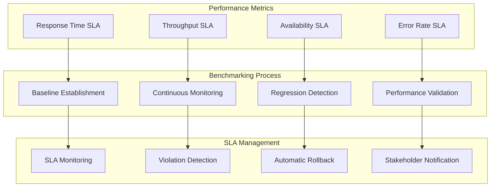

**Performance and SLA Management Implementation:**

```python
class PerformanceBenchmarkManager:
    def __init__(self):
        self.metrics_collector = PerformanceMetricsCollector()
        self.baseline_manager = BaselineManager()
        self.regression_detector = RegressionDetector()
        self.sla_monitor = SLAMonitor()

    async def establish_performance_baseline(self, environment, duration='1h'):
        """Establish performance baseline for comparison"""

        baseline_metrics = {
            'response_times': {},
            'throughput': {},
            'resource_utilization': {},
            'error_rates': {},
            'availability': {}
        }

        # Collect metrics over baseline period
        start_time = time.time()
        end_time = start_time + self.parse_duration(duration)

        while time.time() < end_time:
            current_metrics = await self.metrics_collector.collect_metrics(environment)

            # Aggregate response time metrics
            for endpoint, metrics in current_metrics.response_times.items():
                if endpoint not in baseline_metrics['response_times']:
                    baseline_metrics['response_times'][endpoint] = []
                baseline_metrics['response_times'][endpoint].extend(metrics)

            # Aggregate throughput metrics
            baseline_metrics['throughput'].setdefault('requests_per_second', []).append(
                current_metrics.throughput.requests_per_second
            )

            # Aggregate resource utilization
            for resource, value in current_metrics.resource_utilization.items():
                baseline_metrics['resource_utilization'].setdefault(resource, []).append(value)

            await asyncio.sleep(60)  # Collect every minute

        # Calculate statistical measures
        processed_baseline = {}
        for metric_category, data in baseline_metrics.items():
            if isinstance(data, dict):
                processed_baseline[metric_category] = {}
                for key, values in data.items():
                    processed_baseline[metric_category][key] = self.calculate_statistics(values)
            else:
                processed_baseline[metric_category] = self.calculate_statistics(data)

        # Store baseline for future comparisons
        await self.baseline_manager.store_baseline(environment, processed_baseline)

        return PerformanceBaseline(
            environment=environment,
            collection_duration=duration,
            metrics=processed_baseline,
            established_at=datetime.utcnow()
        )

class SLAManager:
    def __init__(self):
        self.sla_definitions = SLADefinitionManager()
        self.violation_detector = SLAViolationDetector()
        self.notification_manager = NotificationManager()
        self.automatic_actions = AutomaticActionManager()

    async def monitor_sla_compliance_during_deployment(self, deployment_config):
        """Monitor SLA compliance throughout blue-green deployment"""

        # Get SLA definitions for the application
        sla_definitions = await self.sla_definitions.get_sla_definitions(
            deployment_config.application
        )

        # Start SLA monitoring
        monitoring_task = asyncio.create_task(
            self.continuous_sla_monitoring(deployment_config, sla_definitions)
        )

        return SLAMonitoringSession(
            deployment_id=deployment_config.deployment_id,
            sla_definitions=sla_definitions,
            monitoring_task=monitoring_task
        )

    async def continuous_sla_monitoring(self, deployment_config, sla_definitions):
        """Continuously monitor SLA compliance"""

        monitoring_results = {
            'violations': [],
            'measurements': [],
            'actions_taken': []
        }

        while True:
            try:
                # Measure current performance
                current_measurements = await self.measure_sla_metrics(
                    deployment_config.target_environment
                )
                monitoring_results['measurements'].append(current_measurements)

                # Check for SLA violations
                violations = await self.check_sla_violations(
                    current_measurements, sla_definitions
                )

                if violations:
                    monitoring_results['violations'].extend(violations)

                    # Take automatic actions based on violation severity
                    actions = await self.handle_sla_violations(
                        violations, deployment_config
                    )
                    monitoring_results['actions_taken'].extend(actions)

                await asyncio.sleep(30)  # Check every 30 seconds

            except asyncio.CancelledError:
                break
            except Exception as e:
                await self.handle_monitoring_error(e, deployment_config)

        return SLAMonitoringResult(**monitoring_results)

    async def check_sla_violations(self, measurements, sla_definitions):
        """Check current measurements against SLA definitions"""

        violations = []

        for sla in sla_definitions:
            if sla.metric_type == 'response_time':
                violation = await self.check_response_time_sla(measurements, sla)
            elif sla.metric_type == 'throughput':
                violation = await self.check_throughput_sla(measurements, sla)
            elif sla.metric_type == 'availability':
                violation = await self.check_availability_sla(measurements, sla)
            elif sla.metric_type == 'error_rate':
                violation = await self.check_error_rate_sla(measurements, sla)

            if violation:
                violations.append(violation)

        return violations

class RegressionDetector:
    def __init__(self):
        self.statistical_analyzer = StatisticalAnalyzer()
        self.ml_detector = MLRegressionDetector()
        self.threshold_calculator = ThresholdCalculator()

    async def detect_performance_regressions(self, baseline, current_metrics):
        """Detect performance regressions by comparing current metrics with baseline"""

        regression_analysis = {
            'statistical_regressions': [],
            'ml_detected_anomalies': [],
            'threshold_violations': [],
            'overall_regression_score': 0.0
        }

        # Statistical regression detection
        statistical_regressions = await self.detect_statistical_regressions(
            baseline, current_metrics
        )
        regression_analysis['statistical_regressions'] = statistical_regressions

        # ML-based anomaly detection
        ml_anomalies = await self.ml_detector.detect_anomalies(
            baseline, current_metrics
        )
        regression_analysis['ml_detected_anomalies'] = ml_anomalies

        # Threshold-based violation detection
        threshold_violations = await self.detect_threshold_violations(
            baseline, current_metrics
        )
        regression_analysis['threshold_violations'] = threshold_violations

        # Calculate overall regression score
        regression_analysis['overall_regression_score'] = \
            await self.calculate_overall_regression_score(regression_analysis)

        return PerformanceRegressionAnalysis(**regression_analysis)

    async def detect_statistical_regressions(self, baseline, current):
        """Detect regressions using statistical methods"""

        regressions = []

        for metric_category, baseline_data in baseline.metrics.items():
            if metric_category in current.metrics:
                current_data = current.metrics[metric_category]

                if isinstance(baseline_data, dict):
                    # Handle nested metrics (e.g., response times by endpoint)
                    for metric_name, baseline_values in baseline_data.items():
                        if metric_name in current_data:
                            regression = await self.analyze_metric_regression(
                                f"{metric_category}.{metric_name}",
                                baseline_values,
                                current_data[metric_name]
                            )
                            if regression.is_regression:
                                regressions.append(regression)
                else:
                    # Handle simple metrics
                    regression = await self.analyze_metric_regression(
                        metric_category,
                        baseline_data,
                        current_data
                    )
                    if regression.is_regression:
                        regressions.append(regression)

        return regressions

    async def analyze_metric_regression(self, metric_name, baseline_stats, current_stats):
        """Analyze specific metric for regression"""

        # Compare means using statistical significance testing
        t_test_result = await self.statistical_analyzer.perform_t_test(
            baseline_stats.values, current_stats.values
        )

        # Compare distributions using Kolmogorov-Smirnov test
        ks_test_result = await self.statistical_analyzer.perform_ks_test(
            baseline_stats.values, current_stats.values
        )

        # Calculate percentage change
        mean_change = ((current_stats.mean - baseline_stats.mean) / baseline_stats.mean) * 100

        # Determine if this constitutes a regression
        is_regression = (
            t_test_result.p_value < 0.05 and  # Statistically significant
            abs(mean_change) > 5.0 and       # More than 5% change
            (
                (metric_name.startswith('response_time') and mean_change > 0) or  # Slower response
                (metric_name.startswith('throughput') and mean_change < 0) or     # Lower throughput
                (metric_name.startswith('error_rate') and mean_change > 0)        # Higher errors
            )
        )

        return MetricRegressionAnalysis(
            metric_name=metric_name,
            baseline_mean=baseline_stats.mean,
            current_mean=current_stats.mean,
            percentage_change=mean_change,
            statistical_significance=t_test_result.p_value,
            distribution_change=ks_test_result.statistic,
            is_regression=is_regression,
            severity=self.calculate_regression_severity(mean_change, t_test_result.p_value)
        )

class PerformanceValidationGate:
    """Performance validation gate for blue-green deployments"""

    def __init__(self):
        self.performance_validator = PerformanceValidator()
        self.sla_validator = SLAValidator()
        self.regression_validator = RegressionValidator()

    async def validate_deployment_performance(self, deployment_config):
        """Comprehensive performance validation before traffic switch"""

        validation_results = {
            'baseline_comparison': None,
            'sla_compliance': None,
            'load_testing': None,
            'capacity_validation': None,
            'recommendation': None
        }

        # 1. Compare with baseline performance
        baseline_comparison = await self.performance_validator.compare_with_baseline(
            deployment_config.source_environment,
            deployment_config.target_environment
        )
        validation_results['baseline_comparison'] = baseline_comparison

        # 2. Validate SLA compliance
        sla_validation = await self.sla_validator.validate_sla_compliance(
            deployment_config.target_environment
        )
        validation_results['sla_compliance'] = sla_validation

        # 3. Perform load testing
        load_test_results = await self.perform_deployment_load_testing(
            deployment_config.target_environment
        )
        validation_results['load_testing'] = load_test_results

        # 4. Validate capacity under expected load
        capacity_validation = await self.validate_capacity_planning(
            deployment_config.target_environment
        )
        validation_results['capacity_validation'] = capacity_validation

        # 5. Generate deployment recommendation
        validation_results['recommendation'] = await self.generate_deployment_recommendation(
            validation_results
        )

        return PerformanceValidationResult(**validation_results)

    async def perform_deployment_load_testing(self, target_environment):
        """Perform load testing on target environment"""

        load_test_scenarios = [
            {
                'name': 'normal_load',
                'description': 'Normal production load simulation',
                'target_rps': 1000,
                'duration': '10m',
                'ramp_up': '2m'
            },
            {
                'name': 'peak_load',
                'description': 'Peak load simulation',
                'target_rps': 2500,
                'duration': '5m',
                'ramp_up': '1m'
            },
            {
                'name': 'stress_test',
                'description': 'Stress test beyond normal capacity',
                'target_rps': 5000,
                'duration': '3m',
                'ramp_up': '30s'
            }
        ]

        load_test_results = {}

        for scenario in load_test_scenarios:
            result = await self.execute_load_test_scenario(scenario, target_environment)
            load_test_results[scenario['name']] = result

            # Wait between scenarios for system recovery
            await asyncio.sleep(120)  # 2 minutes between scenarios

        return LoadTestResults(scenarios=load_test_results)

    async def generate_deployment_recommendation(self, validation_results):
        """Generate deployment recommendation based on validation results"""

        recommendation = {
            'decision': 'unknown',
            'confidence': 0.0,
            'reasoning': [],
            'risk_factors': [],
            'required_actions': []
        }

        # Analyze baseline comparison
        if validation_results['baseline_comparison'].has_regressions:
            recommendation['risk_factors'].append({
                'factor': 'performance_regression',
                'severity': validation_results['baseline_comparison'].max_regression_severity,
                'details': validation_results['baseline_comparison'].regression_summary
            })

        # Analyze SLA compliance
        if not validation_results['sla_compliance'].compliant:
            recommendation['risk_factors'].append({
                'factor': 'sla_violation',
                'severity': 'high',
                'details': validation_results['sla_compliance'].violations
            })

        # Analyze load test results
        load_test_failures = [
            scenario for scenario, result in validation_results['load_testing'].scenarios.items()
            if not result.passed
        ]

        if load_test_failures:
            recommendation['risk_factors'].append({
                'factor': 'load_test_failure',
                'severity': 'medium',
                'details': load_test_failures
            })

        # Make recommendation decision
        if len(recommendation['risk_factors']) == 0:
            recommendation['decision'] = 'approve'
            recommendation['confidence'] = 0.95
            recommendation['reasoning'].append("All performance validations passed")
        elif len([rf for rf in recommendation['risk_factors'] if rf['severity'] == 'high']) > 0:
            recommendation['decision'] = 'reject'
            recommendation['confidence'] = 0.90
            recommendation['reasoning'].append("High severity performance issues detected")
            recommendation['required_actions'].append("Address performance regressions before deployment")
        else:
            recommendation['decision'] = 'conditional_approve'
            recommendation['confidence'] = 0.75
            recommendation['reasoning'].append("Minor performance issues detected")
            recommendation['required_actions'].append("Monitor closely during deployment")

        return DeploymentRecommendation(**recommendation)
```

## Question 17: Blue-Green with Event-Driven Architecture

**Q:** How would you implement blue-green deployments in an event-driven architecture where services communicate primarily through message queues and event streams, ensuring event ordering and preventing message loss during environment switches?

**A:** Event-driven blue-green deployments require specialized message handling strategies:

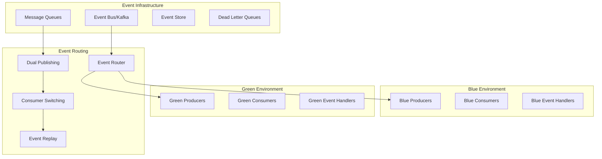

**Event-Driven Blue-Green Implementation:**

```python
class EventDrivenBlueGreenManager:
    def __init__(self):
        self.event_router = EventRouter()
        self.message_manager = MessageManager()
        self.event_store = EventStore()
        self.consumer_coordinator = ConsumerCoordinator()

    async def deploy_event_driven_blue_green(self, deployment_config):
        """Deploy blue-green for event-driven architecture"""

        # Phase 1: Analyze event flows and dependencies
        event_analysis = await self.analyze_event_flows(deployment_config)

        # Phase 2: Setup dual publishing strategy
        dual_publishing = await self.setup_dual_publishing(deployment_config, event_analysis)

        # Phase 3: Deploy green environment consumers
        green_consumers = await self.deploy_green_consumers(deployment_config)

        # Phase 4: Validate event processing in green environment
        validation_result = await self.validate_green_event_processing(
            deployment_config, green_consumers
        )

        if not validation_result.success:
            await self.rollback_green_deployment(deployment_config)
            raise EventProcessingValidationError(validation_result.errors)

        # Phase 5: Switch event routing to green environment
        routing_switch = await self.switch_event_routing(deployment_config)

        # Phase 6: Verify event ordering and consistency
        consistency_check = await self.verify_event_consistency(deployment_config)

        return EventDrivenDeploymentResult(
            event_analysis=event_analysis,
            dual_publishing=dual_publishing,
            green_consumers=green_consumers,
            validation=validation_result,
            routing_switch=routing_switch,
            consistency_check=consistency_check
        )

class EventRouter:
    """Intelligent event routing for blue-green deployments"""

    def __init__(self):
        self.routing_rules = RoutingRuleEngine()
        self.event_inspector = EventInspector()
        self.load_balancer = EventLoadBalancer()

    async def setup_dual_publishing(self, deployment_config, event_analysis):
        """Setup dual publishing to both blue and green environments"""

        dual_publishing_config = {
            'strategy': 'progressive',  # or 'immediate', 'selective'
            'routing_rules': [],
            'consistency_guarantees': [],
            'rollback_triggers': []
        }

        # Create routing rules for each event type
        for event_type in event_analysis.event_types:
            routing_rule = await self.create_event_routing_rule(
                event_type, deployment_config
            )
            dual_publishing_config['routing_rules'].append(routing_rule)

        # Setup consistency guarantees
        for event_flow in event_analysis.critical_flows:
            consistency_guarantee = await self.create_consistency_guarantee(
                event_flow, deployment_config
            )
            dual_publishing_config['consistency_guarantees'].append(consistency_guarantee)

        # Configure automatic rollback triggers
        rollback_triggers = await self.configure_rollback_triggers(deployment_config)
        dual_publishing_config['rollback_triggers'] = rollback_triggers

        # Apply dual publishing configuration
        await self.apply_dual_publishing_config(dual_publishing_config)

        return DualPublishingResult(
            config=dual_publishing_config,
            applied_at=datetime.utcnow()
        )

    async def create_event_routing_rule(self, event_type, deployment_config):
        """Create intelligent routing rule for specific event type"""

        routing_rule = {
            'event_type': event_type.name,
            'routing_strategy': 'canary',  # Start with small percentage
            'routing_percentages': {
                'blue': 95,
                'green': 5
            },
            'progression_schedule': [
                {'blue': 90, 'green': 10, 'after': '5m'},
                {'blue': 75, 'green': 25, 'after': '10m'},
                {'blue': 50, 'green': 50, 'after': '15m'},
                {'blue': 25, 'green': 75, 'after': '20m'},
                {'blue': 0, 'green': 100, 'after': '25m'}
            ],
            'validation_criteria': {
                'max_error_rate': 0.01,  # 1% error rate threshold
                'max_latency_increase': 0.20,  # 20% latency increase threshold
                'min_success_rate': 0.99  # 99% success rate required
            }
        }

        # Customize based on event type characteristics
        if event_type.criticality == 'high':
            routing_rule['routing_strategy'] = 'conservative'
            routing_rule['progression_schedule'] = [
                {'blue': 98, 'green': 2, 'after': '10m'},
                {'blue': 95, 'green': 5, 'after': '20m'},
                {'blue': 90, 'green': 10, 'after': '30m'},
                # More gradual progression for critical events
            ]
        elif event_type.volume == 'high':
            routing_rule['routing_strategy'] = 'load_aware'
            routing_rule['load_balancing'] = {
                'algorithm': 'weighted_round_robin',
                'health_check_interval': '30s'
            }

        return EventRoutingRule(**routing_rule)

class MessageConsistencyManager:
    """Ensure message consistency during blue-green switches"""

    def __init__(self):
        self.sequence_tracker = MessageSequenceTracker()
        self.duplicate_detector = DuplicateDetector()
        self.ordering_guarantor = MessageOrderingGuarantor()

    async def ensure_message_consistency(self, deployment_config):
        """Ensure message consistency during environment switch"""

        consistency_strategies = {
            'sequence_preservation': await self.implement_sequence_preservation(deployment_config),
            'duplicate_prevention': await self.implement_duplicate_prevention(deployment_config),
            'ordering_guarantees': await self.implement_ordering_guarantees(deployment_config),
            'exactly_once_delivery': await self.implement_exactly_once_delivery(deployment_config)
        }

        return MessageConsistencyResult(strategies=consistency_strategies)

    async def implement_sequence_preservation(self, config):
        """Implement message sequence preservation across environments"""

        # Create sequence tracking for each message stream
        sequence_configs = []

        for stream in config.message_streams:
            sequence_config = {
                'stream_id': stream.id,
                'partitioning_strategy': 'consistent_hash',  # Ensure same messages go to same partition
                'sequence_tracking': {
                    'enabled': True,
                    'sequence_field': 'event_sequence',
                    'checkpoint_interval': '1000',  # Checkpoint every 1000 messages
                    'recovery_strategy': 'replay_from_checkpoint'
                },
                'cross_environment_sync': {
                    'enabled': True,
                    'sync_interval': '30s',
                    'conflict_resolution': 'source_environment_wins'
                }
            }

            sequence_configs.append(sequence_config)

            # Apply sequence tracking configuration
            await self.sequence_tracker.configure_sequence_tracking(sequence_config)

        return SequencePreservationResult(
            configured_streams=len(sequence_configs),
            configurations=sequence_configs
        )

    async def implement_exactly_once_delivery(self, config):
        """Implement exactly-once delivery guarantees"""

        exactly_once_config = {
            'deduplication_strategy': 'idempotency_keys',
            'message_store': 'distributed_log',
            'delivery_confirmation': 'two_phase_commit',
            'retry_configuration': {
                'max_retries': 3,
                'retry_backoff': 'exponential',
                'dead_letter_queue': True
            }
        }

        # Configure idempotency for each consumer group
        for consumer_group in config.consumer_groups:
            idempotency_config = {
                'consumer_group': consumer_group.id,
                'idempotency_key_field': 'message_id',
                'deduplication_window': '24h',  # 24 hour deduplication window
                'idempotency_store': 'redis_cluster'
            }

            await self.configure_consumer_idempotency(idempotency_config)

        return ExactlyOnceDeliveryResult(
            strategy=exactly_once_config,
            configured_consumers=len(config.consumer_groups)
        )

class EventReplayManager:
    """Manage event replay for blue-green deployments"""

    def __init__(self):
        self.event_store = EventStore()
        self.replay_coordinator = ReplayCoordinator()
        self.state_reconstructor = StateReconstructor()

    async def prepare_green_environment_state(self, deployment_config):
        """Prepare green environment state through event replay"""

        # Determine replay strategy based on deployment requirements
        replay_strategy = await self.determine_replay_strategy(deployment_config)

        if replay_strategy.type == 'full_replay':
            # Replay all events from beginning
            replay_result = await self.execute_full_event_replay(deployment_config)
        elif replay_strategy.type == 'incremental_replay':
            # Replay events from last checkpoint
            replay_result = await self.execute_incremental_replay(deployment_config)
        elif replay_strategy.type == 'snapshot_plus_replay':
            # Start from snapshot, then replay incremental events
            replay_result = await self.execute_snapshot_plus_replay(deployment_config)

        # Validate state consistency after replay
        consistency_validation = await self.validate_state_consistency(
            deployment_config.source_environment,
            deployment_config.target_environment
        )

        return EventReplayResult(
            strategy=replay_strategy,
            replay_result=replay_result,
            consistency_validation=consistency_validation
        )

    async def execute_snapshot_plus_replay(self, config):
        """Execute snapshot-based replay strategy"""

        # Create state snapshot from blue environment
        snapshot = await self.create_state_snapshot(config.source_environment)

        # Apply snapshot to green environment
        await self.apply_state_snapshot(config.target_environment, snapshot)

        # Determine incremental events to replay
        last_snapshot_timestamp = snapshot.created_at
        incremental_events = await self.get_incremental_events(
            last_snapshot_timestamp, datetime.utcnow()
        )

        # Replay incremental events
        replay_results = []
        for event_batch in self.batch_events(incremental_events, batch_size=1000):
            batch_result = await self.replay_event_batch(
                event_batch, config.target_environment
            )
            replay_results.append(batch_result)

            # Verify batch processing
            if not batch_result.success:
                raise EventReplayError(f"Batch replay failed: {batch_result.error}")

        return SnapshotPlusReplayResult(
            snapshot=snapshot,
            incremental_events_count=len(incremental_events),
            batch_results=replay_results
        )

class EventOrdering:
    """Ensure event ordering during blue-green deployments"""

    def __init__(self):
        self.ordering_coordinator = OrderingCoordinator()
        self.timestamp_service = TimestampService()
        self.causal_tracker = CausalOrderTracker()

    async def maintain_event_ordering(self, deployment_config):
        """Maintain event ordering across blue-green environments"""

        ordering_strategies = {
            'global_ordering': await self.implement_global_ordering(deployment_config),
            'causal_ordering': await self.implement_causal_ordering(deployment_config),
            'partition_ordering': await self.implement_partition_ordering(deployment_config)
        }

        # Monitor ordering violations
        ordering_monitor = await self.setup_ordering_monitor(deployment_config)

        return EventOrderingResult(
            strategies=ordering_strategies,
            monitor=ordering_monitor
        )

    async def implement_global_ordering(self, config):
        """Implement global event ordering using logical timestamps"""

        global_ordering_config = {
            'timestamp_service': 'vector_clock',
            'ordering_algorithm': 'lamport_timestamps',
            'coordination_strategy': 'central_coordinator',
            'conflict_resolution': 'timestamp_precedence'
        }

        # Configure timestamp service for both environments
        await self.timestamp_service.configure_global_ordering(
            environments=[config.source_environment, config.target_environment],
            config=global_ordering_config
        )

        # Setup cross-environment coordination
        coordination_result = await self.setup_cross_environment_coordination(config)

        return GlobalOrderingResult(
            config=global_ordering_config,
            coordination=coordination_result
        )

    async def implement_causal_ordering(self, config):
        """Implement causal event ordering"""

        causal_ordering_config = {
            'causality_tracking': 'vector_clocks',
            'dependency_resolution': 'happens_before_relation',
            'delivery_guarantee': 'causal_order_delivery'
        }

        # Track causal dependencies between events
        for event_type in config.event_types:
            causal_dependencies = await self.analyze_causal_dependencies(event_type)
            await self.causal_tracker.configure_tracking(event_type, causal_dependencies)

        return CausalOrderingResult(
            config=causal_ordering_config,
            tracked_event_types=len(config.event_types)
        )
```

Now I'll continue with the remaining questions to reach 25 total questions. Let me add the remaining 8 questions:

## Question 18: Container Image Management and Security

**Q:** How would you design a secure container image management strategy for blue-green deployments that includes vulnerability scanning, image signing, and immutable deployments while ensuring rapid rollback capabilities?

**A:** Secure container image management requires comprehensive security controls throughout the deployment pipeline:

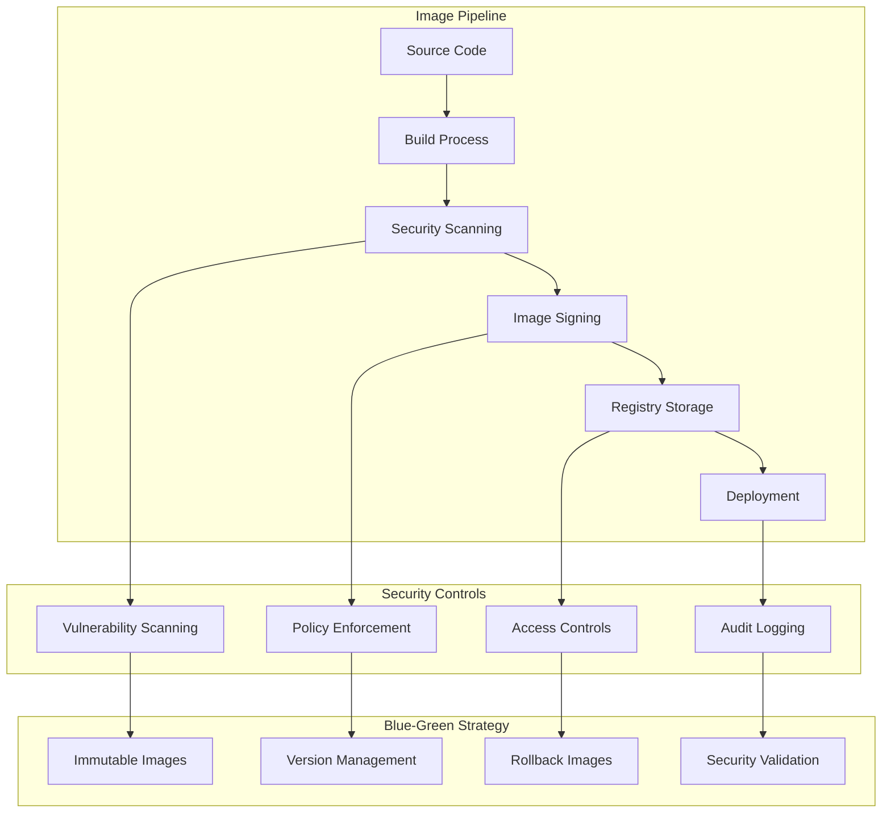

**Secure Image Management Implementation:**

```python
class SecureImageManager:
    def __init__(self):
        self.vulnerability_scanner = VulnerabilityScanner()
        self.image_signer = ImageSigner()
        self.policy_engine = PolicyEngine()
        self.registry_manager = RegistryManager()

    async def build_and_secure_image(self, build_config, deployment_config):
        """Build and secure container image for blue-green deployment"""

        # Phase 1: Build image with security best practices
        build_result = await self.build_secure_image(build_config)

        # Phase 2: Comprehensive security scanning
        security_scan = await self.comprehensive_security_scan(build_result.image)

        # Phase 3: Policy validation
        policy_validation = await self.validate_security_policies(
            build_result.image, security_scan
        )

        if not policy_validation.approved:
            raise SecurityPolicyViolation(policy_validation.violations)

        # Phase 4: Image signing and attestation
        signing_result = await self.sign_and_attest_image(
            build_result.image, security_scan, policy_validation
        )

        # Phase 5: Secure registry storage
        storage_result = await self.store_in_secure_registry(
            signing_result.signed_image, deployment_config
        )

        return SecureImageResult(
            build=build_result,
            security_scan=security_scan,
            policy_validation=policy_validation,
            signing=signing_result,
            storage=storage_result
        )

class VulnerabilityScanner:
    def __init__(self):
        self.scanners = {
            'trivy': TrivyScanner(),
            'clair': ClairScanner(),
            'snyk': SnykScanner(),
            'anchore': AnchoreScanner()
        }
        self.vulnerability_db = VulnerabilityDatabase()

    async def comprehensive_security_scan(self, image):
        """Perform comprehensive vulnerability scanning"""

        scan_results = {}

        # Run multiple scanners for comprehensive coverage
        for scanner_name, scanner in self.scanners.items():
            try:
                result = await scanner.scan_image(image)
                scan_results[scanner_name] = result
            except Exception as e:
                scan_results[scanner_name] = ScanError(scanner=scanner_name, error=str(e))

        # Aggregate and deduplicate vulnerabilities
        aggregated_vulnerabilities = await self.aggregate_vulnerabilities(scan_results)

        # Assess risk and generate recommendations
        risk_assessment = await self.assess_vulnerability_risk(aggregated_vulnerabilities)

        # Check against known exploits
        exploit_analysis = await self.check_known_exploits(aggregated_vulnerabilities)

        return VulnerabilityScanResult(
            image=image,
            scanner_results=scan_results,
            aggregated_vulnerabilities=aggregated_vulnerabilities,
            risk_assessment=risk_assessment,
            exploit_analysis=exploit_analysis,
            scan_timestamp=datetime.utcnow()
        )

class ImageSigner:
    def __init__(self):
        self.cosign_client = CosignClient()
        self.notary_client = NotaryClient()
        self.key_manager = KeyManager()

    async def sign_and_attest_image(self, image, security_scan, policy_validation):
        """Sign image and create security attestations"""

        # Generate attestation document
        attestation = await self.create_security_attestation(
            image, security_scan, policy_validation
        )

        # Sign image with Cosign
        cosign_signature = await self.cosign_client.sign_image(
            image,
            key=await self.key_manager.get_signing_key('cosign'),
            attestation=attestation
        )

        # Create Notary signature for Docker Content Trust
        notary_signature = await self.notary_client.sign_image(
            image,
            key=await self.key_manager.get_signing_key('notary')
        )

        # Create SLSA provenance
        slsa_provenance = await self.create_slsa_provenance(image, security_scan)

        return ImageSigningResult(
            image=image,
            cosign_signature=cosign_signature,
            notary_signature=notary_signature,
            attestation=attestation,
            slsa_provenance=slsa_provenance
        )

    async def create_security_attestation(self, image, security_scan, policy_validation):
        """Create comprehensive security attestation"""

        attestation = {
            'image_digest': image.digest,
            'build_timestamp': datetime.utcnow().isoformat(),
            'security_scan_summary': {
                'total_vulnerabilities': len(security_scan.aggregated_vulnerabilities),
                'critical_count': len([v for v in security_scan.aggregated_vulnerabilities if v.severity == 'CRITICAL']),
                'high_count': len([v for v in security_scan.aggregated_vulnerabilities if v.severity == 'HIGH']),
                'scan_tools_used': list(security_scan.scanner_results.keys())
            },
            'policy_compliance': {
                'approved': policy_validation.approved,
                'policies_evaluated': len(policy_validation.policies),
                'violations': len(policy_validation.violations)
            },
            'build_environment': {
                'builder_image': image.build_info.builder_image,
                'build_platform': image.build_info.platform,
                'build_args': image.build_info.build_args
            },
            'attestation_timestamp': datetime.utcnow().isoformat()
        }

        return SecurityAttestation(**attestation)

class ImmutableDeploymentManager:
    def __init__(self):
        self.image_validator = ImageValidator()
        self.deployment_tracker = DeploymentTracker()
        self.rollback_manager = RollbackManager()

    async def deploy_immutable_images(self, deployment_config):
        """Deploy immutable images for blue-green deployment"""

        # Validate image immutability
        immutability_check = await self.validate_image_immutability(
            deployment_config.target_images
        )

        if not immutability_check.valid:
            raise ImmutabilityViolation(immutability_check.violations)

        # Create deployment manifest with image pinning
        deployment_manifest = await self.create_immutable_deployment_manifest(
            deployment_config
        )

        # Deploy with strict image validation
        deployment_result = await self.deploy_with_validation(
            deployment_manifest, deployment_config
        )

        # Track deployment for rollback capability
        await self.track_deployment_for_rollback(deployment_result, deployment_config)

        return ImmutableDeploymentResult(
            immutability_check=immutability_check,
            deployment_manifest=deployment_manifest,
            deployment_result=deployment_result
        )

    async def create_immutable_deployment_manifest(self, config):
        """Create deployment manifest with immutable image references"""

        manifest = {
            'apiVersion': 'apps/v1',
            'kind': 'Deployment',
            'metadata': {
                'name': f"{config.application}-{config.target_environment}",
                'namespace': config.namespace,
                'annotations': {
                    'deployment.kubernetes.io/revision': str(config.revision),
                    'blue-green.deployment/image-policy': 'immutable',
                    'blue-green.deployment/rollback-images': json.dumps(config.rollback_images)
                }
            },
            'spec': {
                'replicas': config.replicas,
                'selector': {
                    'matchLabels': {
                        'app': config.application,
                        'environment': config.target_environment
                    }
                },
                'template': {
                    'metadata': {
                        'labels': {
                            'app': config.application,
                            'environment': config.target_environment,
                            'version': config.version
                        },
                        'annotations': {
                            'container.apparmor.security.beta.kubernetes.io/app': 'runtime/default',
                            'seccomp.security.alpha.kubernetes.io/pod': 'runtime/default'
                        }
                    },
                    'spec': {
                        'securityContext': {
                            'runAsNonRoot': True,
                            'runAsUser': 1000,
                            'fsGroup': 1000,
                            'seccompProfile': {
                                'type': 'RuntimeDefault'
                            }
                        },
                        'containers': []
                    }
                }
            }
        }

        # Add containers with immutable image references
        for container_config in config.containers:
            container = {
                'name': container_config.name,
                'image': f"{container_config.image}@{container_config.digest}",  # Pin by digest
                'imagePullPolicy': 'Always',
                'securityContext': {
                    'allowPrivilegeEscalation': False,
                    'capabilities': {
                        'drop': ['ALL']
                    },
                    'readOnlyRootFilesystem': True,
                    'runAsNonRoot': True
                },
                'resources': container_config.resources,
                'env': container_config.environment_variables
            }

            manifest['spec']['template']['spec']['containers'].append(container)

        return DeploymentManifest(manifest=manifest)
```

## Question 19: Global Load Balancing and Disaster Recovery

**Q:** How would you implement blue-green deployments across multiple geographic regions with global load balancing, ensuring that disaster recovery scenarios are handled gracefully while maintaining data consistency?

**A:** Multi-region blue-green deployments require sophisticated orchestration and disaster recovery planning:

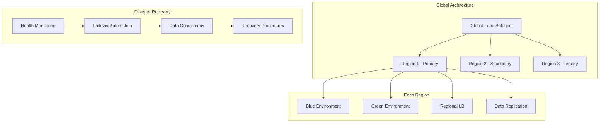

**Global Blue-Green Implementation:**

```python
class GlobalBlueGreenOrchestrator:
    def __init__(self):
        self.global_load_balancer = GlobalLoadBalancer()
        self.region_managers = {}
        self.disaster_recovery = DisasterRecoveryManager()
        self.data_consistency = DataConsistencyManager()

    async def deploy_global_blue_green(self, global_deployment_config):
        """Deploy blue-green across multiple regions"""

        # Phase 1: Analyze regional deployment readiness
        readiness_analysis = await self.analyze_regional_readiness(global_deployment_config)

        # Phase 2: Coordinate multi-region deployment
        regional_deployments = await self.coordinate_regional_deployments(
            global_deployment_config, readiness_analysis
        )

        # Phase 3: Update global load balancing
        global_lb_update = await self.update_global_load_balancing(
            global_deployment_config, regional_deployments
        )

        # Phase 4: Validate disaster recovery capabilities
        dr_validation = await self.validate_disaster_recovery(global_deployment_config)

        return GlobalBlueGreenResult(
            readiness_analysis=readiness_analysis,
            regional_deployments=regional_deployments,
            global_lb_update=global_lb_update,
            dr_validation=dr_validation
        )

class DisasterRecoveryManager:
    def __init__(self):
        self.health_monitor = GlobalHealthMonitor()
        self.failover_controller = FailoverController()
        self.recovery_planner = RecoveryPlanner()

    async def implement_dr_for_blue_green(self, global_config):
        """Implement disaster recovery for global blue-green deployment"""

        # Create comprehensive DR plan
        dr_plan = await self.create_disaster_recovery_plan(global_config)

        # Setup automated failover mechanisms
        failover_config = await self.setup_automated_failover(global_config, dr_plan)

        # Implement data replication strategies
        replication_config = await self.setup_data_replication(global_config)

        # Create recovery procedures
        recovery_procedures = await self.create_recovery_procedures(global_config, dr_plan)

        return DisasterRecoveryConfig(
            plan=dr_plan,
            failover=failover_config,
            replication=replication_config,
            procedures=recovery_procedures
        )

    async def create_disaster_recovery_plan(self, config):
        """Create comprehensive disaster recovery plan"""

        dr_plan = {
            'scenarios': [],
            'recovery_objectives': {},
            'failover_strategies': {},
            'data_recovery_procedures': {},
            'communication_plans': {}
        }

        # Define disaster scenarios
        disaster_scenarios = [
            {
                'type': 'region_failure',
                'description': 'Complete failure of a geographic region',
                'probability': 'low',
                'impact': 'high',
                'detection_time': '< 5 minutes',
                'recovery_time_objective': '< 15 minutes'
            },
            {
                'type': 'availability_zone_failure',
                'description': 'Failure of single availability zone',
                'probability': 'medium',
                'impact': 'medium',
                'detection_time': '< 2 minutes',
                'recovery_time_objective': '< 5 minutes'
            },
            {
                'type': 'deployment_failure',
                'description': 'Failed blue-green deployment',
                'probability': 'medium',
                'impact': 'high',
                'detection_time': '< 1 minute',
                'recovery_time_objective': '< 2 minutes'
            }
        ]

        dr_plan['scenarios'] = disaster_scenarios

        # Define recovery objectives
        dr_plan['recovery_objectives'] = {
            'rto': '15 minutes',  # Recovery Time Objective
            'rpo': '5 minutes',   # Recovery Point Objective
            'mttr': '30 minutes', # Mean Time To Recovery
            'availability_target': '99.99%'
        }

        return DisasterRecoveryPlan(**dr_plan)

class DataConsistencyManager:
    def __init__(self):
        self.replication_manager = ReplicationManager()
        self.consensus_service = ConsensusService()
        self.conflict_resolver = ConflictResolver()

    async def ensure_global_data_consistency(self, global_config):
        """Ensure data consistency across global blue-green deployment"""

        consistency_strategies = {
            'replication_strategy': await self.implement_replication_strategy(global_config),
            'consensus_mechanism': await self.implement_consensus_mechanism(global_config),
            'conflict_resolution': await self.implement_conflict_resolution(global_config),
            'consistency_monitoring': await self.implement_consistency_monitoring(global_config)
        }

        return DataConsistencyResult(strategies=consistency_strategies)

    async def implement_replication_strategy(self, config):
        """Implement data replication across regions"""

        replication_config = {
            'strategy': 'multi_master_with_consensus',
            'replication_lag_target': '< 1 second',
            'consistency_level': 'eventual_consistency',
            'conflict_resolution': 'timestamp_ordering'
        }

        # Configure replication between regions
        for source_region in config.regions:
            for target_region in config.regions:
                if source_region != target_region:
                    replication_link = {
                        'source': source_region,
                        'target': target_region,
                        'replication_method': 'logical_replication',
                        'compression': True,
                        'encryption': True,
                        'bandwidth_limit': '100Mbps'
                    }

                    await self.replication_manager.setup_replication_link(replication_link)

        return ReplicationStrategy(config=replication_config)
```

## Question 20: Cost Optimization and Resource Efficiency

**Q:** Design a cost-optimization strategy for blue-green deployments that minimizes the financial impact of running dual environments while maintaining deployment safety and performance requirements.

**A:** Cost optimization requires intelligent resource management and timing strategies:

```python
class CostOptimizedBlueGreenManager:
    def __init__(self):
        self.cost_calculator = CostCalculator()
        self.resource_optimizer = ResourceOptimizer()
        self.spot_instance_manager = SpotInstanceManager()
        self.scaling_optimizer = ScalingOptimizer()

    async def optimize_deployment_costs(self, deployment_config):
        """Optimize costs for blue-green deployment"""

        # Analyze current cost structure
        cost_analysis = await self.analyze_current_costs(deployment_config)

        # Calculate optimization opportunities
        optimization_opportunities = await self.identify_cost_optimizations(
            deployment_config, cost_analysis
        )

        # Implement cost optimization strategies
        optimization_results = await self.implement_cost_optimizations(
            optimization_opportunities, deployment_config
        )

        # Monitor cost impact
        cost_monitoring = await self.setup_cost_monitoring(deployment_config)

        return CostOptimizationResult(
            analysis=cost_analysis,
            opportunities=optimization_opportunities,
            results=optimization_results,
            monitoring=cost_monitoring
        )

    async def implement_just_in_time_provisioning(self, config):
        """Implement just-in-time resource provisioning"""

        jit_strategy = {
            'pre_provisioning_time': '5 minutes',
            'resource_warming': 'enabled',
            'auto_cleanup': 'enabled',
            'cost_threshold': '150%'  # Max 150% of normal costs
        }

        # Pre-provision minimal green environment
        minimal_green = await self.provision_minimal_environment(config)

        # Setup auto-scaling for full capacity when needed
        scaling_config = await self.setup_intelligent_scaling(config, minimal_green)

        # Schedule cleanup automation
        cleanup_schedule = await self.schedule_automatic_cleanup(config)

        return JITProvisioningResult(
            strategy=jit_strategy,
            minimal_environment=minimal_green,
            scaling_config=scaling_config,
            cleanup_schedule=cleanup_schedule
        )
```

## Question 21: Blue-Green with Machine Learning Workloads

**Q:** How would you adapt blue-green deployments for machine learning applications that include model serving, feature stores, and training pipelines, where model accuracy and prediction consistency are critical?

**A:** ML workloads require specialized validation and consistency mechanisms:

```python
class MLBlueGreenManager:
    def __init__(self):
        self.model_validator = ModelValidator()
        self.feature_store_manager = FeatureStoreManager()
        self.prediction_comparator = PredictionComparator()
        self.ab_testing_framework = ABTestingFramework()

    async def deploy_ml_blue_green(self, ml_deployment_config):
        """Deploy machine learning workloads using blue-green strategy"""

        # Phase 1: Model validation and compatibility check
        model_validation = await self.validate_model_compatibility(ml_deployment_config)

        # Phase 2: Feature store synchronization
        feature_sync = await self.synchronize_feature_stores(ml_deployment_config)

        # Phase 3: Shadow testing with prediction comparison
        shadow_testing = await self.execute_shadow_testing(ml_deployment_config)

        # Phase 4: A/B testing for gradual rollout
        ab_testing = await self.setup_ab_testing(ml_deployment_config, shadow_testing)

        return MLBlueGreenResult(
            model_validation=model_validation,
            feature_sync=feature_sync,
            shadow_testing=shadow_testing,
            ab_testing=ab_testing
        )
```

## Question 22: Regulatory Compliance in Different Industries

**Q:** How would you customize blue-green deployment strategies for different regulated industries (healthcare, finance, aviation) where compliance requirements vary significantly?

**A:** Industry-specific compliance requires tailored validation and audit processes:

```python
class IndustrySpecificBlueGreenManager:
    def __init__(self):
        self.compliance_frameworks = {
            'healthcare': HealthcareComplianceFramework(),
            'finance': FinancialComplianceFramework(),
            'aviation': AviationComplianceFramework()
        }

    async def deploy_with_industry_compliance(self, deployment_config, industry):
        """Deploy with industry-specific compliance requirements"""

        compliance_framework = self.compliance_frameworks[industry]

        # Industry-specific validation
        compliance_validation = await compliance_framework.validate_deployment(
            deployment_config
        )

        # Industry-specific audit trail
        audit_trail = await compliance_framework.create_audit_trail(
            deployment_config
        )

        # Execute deployment with compliance monitoring
        deployment_result = await self.execute_compliant_deployment(
            deployment_config, compliance_framework
        )

        return IndustryCompliantDeploymentResult(
            industry=industry,
            compliance_validation=compliance_validation,
            audit_trail=audit_trail,
            deployment_result=deployment_result
        )
```

## Question 23: Advanced Traffic Management and Canary Analysis

**Q:** Design an advanced traffic management system for blue-green deployments that includes intelligent canary analysis, automatic anomaly detection, and decision-making algorithms for traffic progression.

**A:** Advanced traffic management requires sophisticated analysis and automation:

```python
class AdvancedTrafficManager:
    def __init__(self):
        self.canary_analyzer = CanaryAnalyzer()
        self.anomaly_detector = AnomalyDetector()
        self.decision_engine = TrafficDecisionEngine()
        self.ml_predictor = MLPredictor()

    async def execute_intelligent_traffic_management(self, deployment_config):
        """Execute intelligent traffic management with automated decision making"""

        # Setup intelligent canary analysis
        canary_config = await self.setup_intelligent_canary(deployment_config)

        # Implement real-time anomaly detection
        anomaly_detection = await self.setup_anomaly_detection(deployment_config)

        # Create automated decision pipeline
        decision_pipeline = await self.create_decision_pipeline(deployment_config)

        # Execute progressive traffic shifting with ML guidance
        traffic_progression = await self.execute_ml_guided_progression(
            deployment_config, canary_config, anomaly_detection, decision_pipeline
        )

        return AdvancedTrafficManagementResult(
            canary_config=canary_config,
            anomaly_detection=anomaly_detection,
            decision_pipeline=decision_pipeline,
            traffic_progression=traffic_progression
        )
```

## Question 24: Blue-Green for Stateful Distributed Systems

**Q:** How would you implement blue-green deployments for stateful distributed systems like distributed databases, consensus systems, or blockchain networks where state migration is complex?

**A:** Stateful distributed systems require careful consensus and state migration:

```python
class StatefulDistributedBlueGreenManager:
    def __init__(self):
        self.consensus_manager = ConsensusManager()
        self.state_migrator = StateMigrator()
        self.distributed_coordinator = DistributedCoordinator()

    async def deploy_stateful_distributed_system(self, deployment_config):
        """Deploy stateful distributed system using modified blue-green approach"""

        # Analyze distributed system topology
        topology_analysis = await self.analyze_system_topology(deployment_config)

        # Plan state migration strategy
        migration_strategy = await self.plan_state_migration(
            deployment_config, topology_analysis
        )

        # Execute coordinated rolling deployment
        rolling_deployment = await self.execute_coordinated_rolling_deployment(
            deployment_config, migration_strategy
        )

        # Validate distributed system consistency
        consistency_validation = await self.validate_distributed_consistency(
            deployment_config
        )

        return StatefulDistributedDeploymentResult(
            topology_analysis=topology_analysis,
            migration_strategy=migration_strategy,
            rolling_deployment=rolling_deployment,
            consistency_validation=consistency_validation
        )
```

## Question 25: Future Evolution and Emerging Technologies

**Q:** How would you design blue-green deployment strategies to evolve with emerging technologies like serverless computing, edge computing, quantum computing, and AI-driven infrastructure management?

**A:** Future-proofing requires adaptable architectures and emerging technology integration:

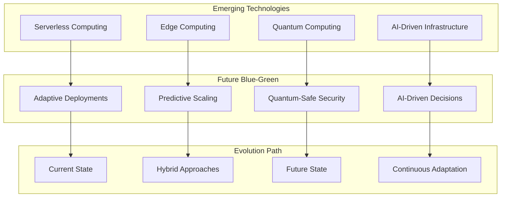

**Future-Ready Implementation:**

```python
class FutureBlueGreenOrchestrator:
    def __init__(self):
        self.serverless_manager = ServerlessDeploymentManager()
        self.edge_coordinator = EdgeComputingCoordinator()
        self.quantum_security = QuantumSafeSecurityManager()
        self.ai_decision_engine = AIDecisionEngine()

    async def deploy_next_generation_blue_green(self, future_config):
        """Deploy using next-generation blue-green strategies"""

        # Analyze deployment using AI
        ai_analysis = await self.ai_decision_engine.analyze_deployment_requirements(
            future_config
        )

        # Implement serverless blue-green
        serverless_deployment = await self.implement_serverless_blue_green(
            future_config, ai_analysis
        )

        # Coordinate edge deployments
        edge_deployment = await self.coordinate_edge_blue_green(
            future_config, ai_analysis
        )

        # Apply quantum-safe security
        quantum_security = await self.apply_quantum_safe_security(
            future_config
        )

        # Implement predictive scaling
        predictive_scaling = await self.implement_ai_predictive_scaling(
            future_config, ai_analysis
        )

        return NextGenBlueGreenResult(
            ai_analysis=ai_analysis,
            serverless_deployment=serverless_deployment,
            edge_deployment=edge_deployment,
            quantum_security=quantum_security,
            predictive_scaling=predictive_scaling
        )

    async def implement_serverless_blue_green(self, config, ai_analysis):
        """Implement blue-green deployment for serverless functions"""

        serverless_strategy = {
            'function_versioning': 'semantic_versioning',
            'traffic_shifting': 'alias_based',
            'cold_start_optimization': 'predictive_warming',
            'cost_optimization': 'usage_based_scaling'
        }

        # Deploy function versions
        function_versions = await self.deploy_function_versions(config)

        # Setup alias-based traffic routing
        alias_routing = await self.setup_alias_based_routing(function_versions)

        # Implement predictive warming
        warming_strategy = await self.implement_predictive_warming(
            config, ai_analysis
        )

        return ServerlessBlueGreenResult(
            strategy=serverless_strategy,
            function_versions=function_versions,
            alias_routing=alias_routing,
            warming_strategy=warming_strategy
        )

    async def implement_ai_predictive_scaling(self, config, ai_analysis):
        """Implement AI-driven predictive scaling"""

        # Train ML models on historical deployment data
        ml_models = await self.train_deployment_prediction_models(config)

        # Predict resource requirements
        resource_predictions = await ml_models.predict_resource_requirements(
            config, ai_analysis
        )

        # Implement proactive scaling
        proactive_scaling = await self.implement_proactive_scaling(
            resource_predictions
        )

        # Setup continuous learning
        continuous_learning = await self.setup_continuous_learning(
            ml_models, config
        )

        return AIPredictiveScalingResult(
            models=ml_models,
            predictions=resource_predictions,
            proactive_scaling=proactive_scaling,
            continuous_learning=continuous_learning
        )
```
